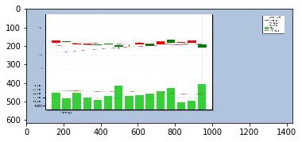
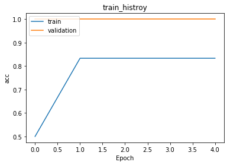
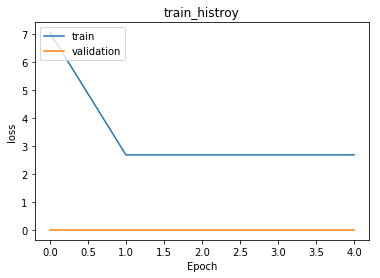

# load in model

from keras.layers import Dense, Dropout, Flatten,Conv2D, MaxPooling2D
from keras.utils import to_categorical
from keras.models import Sequential
from sklearn import model_selection
from keras.utils import np_utils
from keras.datasets import mnist
import matplotlib.pyplot as plt
from scipy import ndimage
from PIL import Image
import pandas as pd
import numpy as np
np.random.seed(10)

# plot function


```python
import matplotlib.pyplot as plt
def show_train_history(train_history, train, validation):
    plt.plot(train_history.history[train])
    plt.plot(train_history.history[validation])
    plt.title('train_histroy')
    plt.ylabel(train)
    plt.xlabel('Epoch')
    plt.legend(['train','validation'], loc='upper left')
    plt.show()
```

# load data


```python
import glob
filelist = sorted(glob.glob('/Users/tyyeh/Documents/Documents - TengYuanYEH MacBook Air/bigdata/final project/*.jpg'))
```


```python
filelist
```


    ['/Users/tyyeh/Documents/Documents - TengYuanYEH MacBook Air/bigdata/final project/20170620-20170710 2330.jpg',
     '/Users/tyyeh/Documents/Documents - TengYuanYEH MacBook Air/bigdata/final project/20170627-20170717 2330.jpg',
     '/Users/tyyeh/Documents/Documents - TengYuanYEH MacBook Air/bigdata/final project/20170704-20170724 2330.jpg',
     '/Users/tyyeh/Documents/Documents - TengYuanYEH MacBook Air/bigdata/final project/20170711-20170731 2330.jpg',
     '/Users/tyyeh/Documents/Documents - TengYuanYEH MacBook Air/bigdata/final project/20170718-20170807 2330.jpg',
     '/Users/tyyeh/Documents/Documents - TengYuanYEH MacBook Air/bigdata/final project/20170725-20170814 2330.jpg',
     '/Users/tyyeh/Documents/Documents - TengYuanYEH MacBook Air/bigdata/final project/20170801-20170821 2330.jpg',
     '/Users/tyyeh/Documents/Documents - TengYuanYEH MacBook Air/bigdata/final project/20170808-20170828 2330.jpg',
     '/Users/tyyeh/Documents/Documents - TengYuanYEH MacBook Air/bigdata/final project/20170815-20170904 2330.jpg',
     '/Users/tyyeh/Documents/Documents - TengYuanYEH MacBook Air/bigdata/final project/20170822-20170911 2330.jpg',
     '/Users/tyyeh/Documents/Documents - TengYuanYEH MacBook Air/bigdata/final project/20170829-20170918 2330.jpg',
     '/Users/tyyeh/Documents/Documents - TengYuanYEH MacBook Air/bigdata/final project/20170905-20170925 2330.jpg',
     '/Users/tyyeh/Documents/Documents - TengYuanYEH MacBook Air/bigdata/final project/20170912-20171002 2330.jpg',
     '/Users/tyyeh/Documents/Documents - TengYuanYEH MacBook Air/bigdata/final project/20170919-20171009 2330.jpg',
     '/Users/tyyeh/Documents/Documents - TengYuanYEH MacBook Air/bigdata/final project/20170926-20171016 2330.jpg',
     '/Users/tyyeh/Documents/Documents - TengYuanYEH MacBook Air/bigdata/final project/20171003-20171023 2330.jpg',
     '/Users/tyyeh/Documents/Documents - TengYuanYEH MacBook Air/bigdata/final project/20171010-20171030 2330.jpg',
     '/Users/tyyeh/Documents/Documents - TengYuanYEH MacBook Air/bigdata/final project/20171017-20171106 2330.jpg',
     '/Users/tyyeh/Documents/Documents - TengYuanYEH MacBook Air/bigdata/final project/20171024-20171113 2330.jpg',
     '/Users/tyyeh/Documents/Documents - TengYuanYEH MacBook Air/bigdata/final project/20171031-20171120 2330.jpg',
     '/Users/tyyeh/Documents/Documents - TengYuanYEH MacBook Air/bigdata/final project/20171107-20171127 2330.jpg',
     '/Users/tyyeh/Documents/Documents - TengYuanYEH MacBook Air/bigdata/final project/20171114-20171204 2330.jpg',
     '/Users/tyyeh/Documents/Documents - TengYuanYEH MacBook Air/bigdata/final project/20171121-20171211 2330.jpg',
     '/Users/tyyeh/Documents/Documents - TengYuanYEH MacBook Air/bigdata/final project/20171128-20171218 2330.jpg',
     '/Users/tyyeh/Documents/Documents - TengYuanYEH MacBook Air/bigdata/final project/20171205-20171225 2330.jpg',
     '/Users/tyyeh/Documents/Documents - TengYuanYEH MacBook Air/bigdata/final project/20171212-20180101 2330.jpg',
     '/Users/tyyeh/Documents/Documents - TengYuanYEH MacBook Air/bigdata/final project/20171219-20180108 2330.jpg',
     '/Users/tyyeh/Documents/Documents - TengYuanYEH MacBook Air/bigdata/final project/20171226-20180115 2330.jpg',
     '/Users/tyyeh/Documents/Documents - TengYuanYEH MacBook Air/bigdata/final project/20180102-20180122 2330.jpg',
     '/Users/tyyeh/Documents/Documents - TengYuanYEH MacBook Air/bigdata/final project/20180109-20180129 2330.jpg',
     '/Users/tyyeh/Documents/Documents - TengYuanYEH MacBook Air/bigdata/final project/20180116-20180205 2330.jpg',
     '/Users/tyyeh/Documents/Documents - TengYuanYEH MacBook Air/bigdata/final project/20180123-20180212 2330.jpg',
     '/Users/tyyeh/Documents/Documents - TengYuanYEH MacBook Air/bigdata/final project/20180130-20180219 2330.jpg',
     '/Users/tyyeh/Documents/Documents - TengYuanYEH MacBook Air/bigdata/final project/20180206-20180226 2330.jpg',
     '/Users/tyyeh/Documents/Documents - TengYuanYEH MacBook Air/bigdata/final project/20180213-20180305 2330.jpg',
     '/Users/tyyeh/Documents/Documents - TengYuanYEH MacBook Air/bigdata/final project/20180220-20180312 2330.jpg',
     '/Users/tyyeh/Documents/Documents - TengYuanYEH MacBook Air/bigdata/final project/20180227-20180319 2330.jpg',
     '/Users/tyyeh/Documents/Documents - TengYuanYEH MacBook Air/bigdata/final project/20180306-20180326 2330.jpg',
     '/Users/tyyeh/Documents/Documents - TengYuanYEH MacBook Air/bigdata/final project/20180313-20180402 2330.jpg',
     '/Users/tyyeh/Documents/Documents - TengYuanYEH MacBook Air/bigdata/final project/20180320-20180409 2330.jpg',
     '/Users/tyyeh/Documents/Documents - TengYuanYEH MacBook Air/bigdata/final project/20180327-20180416 2330.jpg',
     '/Users/tyyeh/Documents/Documents - TengYuanYEH MacBook Air/bigdata/final project/20180403-20180423 2330.jpg',
     '/Users/tyyeh/Documents/Documents - TengYuanYEH MacBook Air/bigdata/final project/20180410-20180430 2330.jpg',
     '/Users/tyyeh/Documents/Documents - TengYuanYEH MacBook Air/bigdata/final project/20180417-20180507 2330.jpg',
     '/Users/tyyeh/Documents/Documents - TengYuanYEH MacBook Air/bigdata/final project/20180424-20180514 2330.jpg',
     '/Users/tyyeh/Documents/Documents - TengYuanYEH MacBook Air/bigdata/final project/20180501-20180521 2330.jpg',
     '/Users/tyyeh/Documents/Documents - TengYuanYEH MacBook Air/bigdata/final project/20180508-20180528 2330.jpg',
     '/Users/tyyeh/Documents/Documents - TengYuanYEH MacBook Air/bigdata/final project/20180515-20180604 2330.jpg',
     '/Users/tyyeh/Documents/Documents - TengYuanYEH MacBook Air/bigdata/final project/20180522-20180611 2330.jpg',
     '/Users/tyyeh/Documents/Documents - TengYuanYEH MacBook Air/bigdata/final project/20180529-20180618 2330.jpg']


```python
x = np.array([np.array(Image.open(fname)) for fname in filelist])
```


```python
x.shape
```


    (50, 615, 1432, 3)


```python
plt.imshow(x[20], cmap='gray')
```


    <matplotlib.image.AxesImage at 0x103bbd320>





```python
Y = pd.read_csv("/Users/tyyeh/Documents/Documents - TengYuanYEH MacBook Air/bigdata/final project/20170620-201806180-2330-chinese-v7.csv")
Y.info()
```

    <class 'pandas.core.frame.DataFrame'>
    RangeIndex: 50 entries, 0 to 49
    Data columns (total 1 columns):
    close    50 non-null int64
    dtypes: int64(1)
    memory usage: 480.0 bytes
    


```python
train_X, test_X, train_y, test_y = model_selection.train_test_split(x, Y, test_size = 0.3)
```


```python
train_X.shape
```


    (35, 615, 1432, 3)


# x_train normalize & 4D matrix


```python
x_train4D = train_X.reshape(train_X.shape[0], 615, 1432, 3).astype('float64')
x_test4D = test_X.reshape(test_X.shape[0], 615, 1432, 3).astype('float64')
```


```python
x_train4D
```


    array([[[[  0.,   0.,  12.],
             [  9.,  12.,  27.],
             [  0.,   0.,  14.],
             ...,
             [  0.,   0.,  23.],
             [  6.,  13.,  29.],
             [  0.,   0.,   9.]],
    
            [[ 17.,  20.,  35.],
             [165., 171., 185.],
             [189., 195., 211.],
             ...,
             [187., 195., 218.],
             [164., 171., 189.],
             [ 17.,  21.,  30.]],
    
            [[  0.,   0.,  14.],
             [192., 198., 214.],
             [203., 210., 226.],
             ...,
             [202., 210., 233.],
             [191., 198., 216.],
             [  0.,   0.,   9.]],
    
            ...,
    
            [[  0.,   2.,  19.],
             [180., 193., 210.],
             [193., 206., 223.],
             ...,
             [194., 206., 218.],
             [183., 193., 203.],
             [  0.,   1.,   9.]],
    
            [[  4.,  14.,  26.],
             [160., 170., 182.],
             [197., 207., 219.],
             ...,
             [199., 206., 214.],
             [162., 169., 175.],
             [  8.,  13.,  19.]],
    
            [[  0.,   2.,   9.],
             [ 12.,  21.,  28.],
             [  0.,   2.,   9.],
             ...,
             [  0.,   0.,   5.],
             [ 16.,  20.,  23.],
             [  0.,   1.,   4.]]],
    
    
           [[[  0.,   0.,  12.],
             [  9.,  12.,  27.],
             [  0.,   0.,  14.],
             ...,
             [  0.,   0.,  23.],
             [  6.,  13.,  29.],
             [  0.,   0.,   9.]],
    
            [[ 17.,  20.,  35.],
             [165., 171., 185.],
             [189., 195., 211.],
             ...,
             [187., 195., 218.],
             [164., 171., 189.],
             [ 17.,  21.,  30.]],
    
            [[  0.,   0.,  14.],
             [192., 198., 214.],
             [203., 210., 226.],
             ...,
             [202., 210., 233.],
             [191., 198., 216.],
             [  0.,   0.,   9.]],
    
            ...,
    
            [[  0.,   2.,  19.],
             [180., 193., 210.],
             [193., 206., 223.],
             ...,
             [194., 206., 218.],
             [183., 193., 203.],
             [  0.,   1.,   9.]],
    
            [[  4.,  14.,  26.],
             [160., 170., 182.],
             [197., 207., 219.],
             ...,
             [199., 206., 214.],
             [162., 169., 175.],
             [  8.,  13.,  19.]],
    
            [[  0.,   2.,   9.],
             [ 12.,  21.,  28.],
             [  0.,   2.,   9.],
             ...,
             [  0.,   0.,   5.],
             [ 16.,  20.,  23.],
             [  0.,   1.,   4.]]],
    
    
           [[[  0.,   0.,  12.],
             [  9.,  12.,  27.],
             [  0.,   0.,  14.],
             ...,
             [  0.,   0.,  23.],
             [  6.,  13.,  29.],
             [  0.,   0.,   9.]],
    
            [[ 17.,  20.,  35.],
             [165., 171., 185.],
             [189., 195., 211.],
             ...,
             [187., 195., 218.],
             [164., 171., 189.],
             [ 17.,  21.,  30.]],
    
            [[  0.,   0.,  14.],
             [192., 198., 214.],
             [203., 210., 226.],
             ...,
             [202., 210., 233.],
             [191., 198., 216.],
             [  0.,   0.,   9.]],
    
            ...,
    
            [[  0.,   2.,  19.],
             [180., 193., 210.],
             [193., 206., 223.],
             ...,
             [194., 206., 218.],
             [183., 193., 203.],
             [  0.,   1.,   9.]],
    
            [[  4.,  14.,  26.],
             [160., 170., 182.],
             [197., 207., 219.],
             ...,
             [199., 206., 214.],
             [162., 169., 175.],
             [  8.,  13.,  19.]],
    
            [[  0.,   2.,   9.],
             [ 12.,  21.,  28.],
             [  0.,   2.,   9.],
             ...,
             [  0.,   0.,   5.],
             [ 16.,  20.,  23.],
             [  0.,   1.,   4.]]],
    
    
           ...,
    
    
           [[[  0.,   0.,  12.],
             [  9.,  12.,  27.],
             [  0.,   0.,  14.],
             ...,
             [  0.,   0.,  23.],
             [  6.,  13.,  29.],
             [  0.,   0.,   9.]],
    
            [[ 17.,  20.,  35.],
             [165., 171., 185.],
             [189., 195., 211.],
             ...,
             [187., 195., 218.],
             [164., 171., 189.],
             [ 17.,  21.,  30.]],
    
            [[  0.,   0.,  14.],
             [192., 198., 214.],
             [203., 210., 226.],
             ...,
             [202., 210., 233.],
             [191., 198., 216.],
             [  0.,   0.,   9.]],
    
            ...,
    
            [[  0.,   2.,  19.],
             [180., 193., 210.],
             [193., 206., 223.],
             ...,
             [194., 206., 218.],
             [183., 193., 203.],
             [  0.,   1.,   9.]],
    
            [[  4.,  14.,  26.],
             [160., 170., 182.],
             [197., 207., 219.],
             ...,
             [199., 206., 214.],
             [162., 169., 175.],
             [  8.,  13.,  19.]],
    
            [[  0.,   2.,   9.],
             [ 12.,  21.,  28.],
             [  0.,   2.,   9.],
             ...,
             [  0.,   0.,   5.],
             [ 16.,  20.,  23.],
             [  0.,   1.,   4.]]],
    
    
           [[[  0.,   0.,  12.],
             [  9.,  12.,  27.],
             [  0.,   0.,  14.],
             ...,
             [  0.,   0.,  23.],
             [  6.,  13.,  29.],
             [  0.,   0.,   9.]],
    
            [[ 17.,  20.,  35.],
             [165., 171., 185.],
             [189., 195., 211.],
             ...,
             [187., 195., 218.],
             [164., 171., 189.],
             [ 17.,  21.,  30.]],
    
            [[  0.,   0.,  14.],
             [192., 198., 214.],
             [203., 210., 226.],
             ...,
             [202., 210., 233.],
             [191., 198., 216.],
             [  0.,   0.,   9.]],
    
            ...,
    
            [[  0.,   2.,  19.],
             [180., 193., 210.],
             [193., 206., 223.],
             ...,
             [194., 206., 218.],
             [183., 193., 203.],
             [  0.,   1.,   9.]],
    
            [[  4.,  14.,  26.],
             [160., 170., 182.],
             [197., 207., 219.],
             ...,
             [199., 206., 214.],
             [162., 169., 175.],
             [  8.,  13.,  19.]],
    
            [[  0.,   2.,   9.],
             [ 12.,  21.,  28.],
             [  0.,   2.,   9.],
             ...,
             [  0.,   0.,   5.],
             [ 16.,  20.,  23.],
             [  0.,   1.,   4.]]],
    
    
           [[[  0.,   0.,  12.],
             [  9.,  12.,  27.],
             [  0.,   0.,  14.],
             ...,
             [  0.,   0.,  23.],
             [  6.,  13.,  29.],
             [  0.,   0.,   9.]],
    
            [[ 17.,  20.,  35.],
             [165., 171., 185.],
             [189., 195., 211.],
             ...,
             [187., 195., 218.],
             [164., 171., 189.],
             [ 17.,  21.,  30.]],
    
            [[  0.,   0.,  14.],
             [192., 198., 214.],
             [203., 210., 226.],
             ...,
             [202., 210., 233.],
             [191., 198., 216.],
             [  0.,   0.,   9.]],
    
            ...,
    
            [[  0.,   2.,  19.],
             [180., 193., 210.],
             [193., 206., 223.],
             ...,
             [194., 206., 218.],
             [183., 193., 203.],
             [  0.,   1.,   9.]],
    
            [[  4.,  14.,  26.],
             [160., 170., 182.],
             [197., 207., 219.],
             ...,
             [199., 206., 214.],
             [162., 169., 175.],
             [  8.,  13.,  19.]],
    
            [[  0.,   2.,   9.],
             [ 12.,  21.,  28.],
             [  0.,   2.,   9.],
             ...,
             [  0.,   0.,   5.],
             [ 16.,  20.,  23.],
             [  0.,   1.,   4.]]]])


```python
x_train4D_normalize = x_train4D / 255 #normailize
x_test4D_normalize = x_test4D/ 255
```


```python
x_train4D_normalize
```


    array([[[[0.        , 0.        , 0.04705882],
             [0.03529412, 0.04705882, 0.10588235],
             [0.        , 0.        , 0.05490196],
             ...,
             [0.        , 0.        , 0.09019608],
             [0.02352941, 0.05098039, 0.11372549],
             [0.        , 0.        , 0.03529412]],
    
            [[0.06666667, 0.07843137, 0.1372549 ],
             [0.64705882, 0.67058824, 0.7254902 ],
             [0.74117647, 0.76470588, 0.82745098],
             ...,
             [0.73333333, 0.76470588, 0.85490196],
             [0.64313725, 0.67058824, 0.74117647],
             [0.06666667, 0.08235294, 0.11764706]],
    
            [[0.        , 0.        , 0.05490196],
             [0.75294118, 0.77647059, 0.83921569],
             [0.79607843, 0.82352941, 0.88627451],
             ...,
             [0.79215686, 0.82352941, 0.91372549],
             [0.74901961, 0.77647059, 0.84705882],
             [0.        , 0.        , 0.03529412]],
    
            ...,
    
            [[0.        , 0.00784314, 0.0745098 ],
             [0.70588235, 0.75686275, 0.82352941],
             [0.75686275, 0.80784314, 0.8745098 ],
             ...,
             [0.76078431, 0.80784314, 0.85490196],
             [0.71764706, 0.75686275, 0.79607843],
             [0.        , 0.00392157, 0.03529412]],
    
            [[0.01568627, 0.05490196, 0.10196078],
             [0.62745098, 0.66666667, 0.71372549],
             [0.77254902, 0.81176471, 0.85882353],
             ...,
             [0.78039216, 0.80784314, 0.83921569],
             [0.63529412, 0.6627451 , 0.68627451],
             [0.03137255, 0.05098039, 0.0745098 ]],
    
            [[0.        , 0.00784314, 0.03529412],
             [0.04705882, 0.08235294, 0.10980392],
             [0.        , 0.00784314, 0.03529412],
             ...,
             [0.        , 0.        , 0.01960784],
             [0.0627451 , 0.07843137, 0.09019608],
             [0.        , 0.00392157, 0.01568627]]],
    
    
           [[[0.        , 0.        , 0.04705882],
             [0.03529412, 0.04705882, 0.10588235],
             [0.        , 0.        , 0.05490196],
             ...,
             [0.        , 0.        , 0.09019608],
             [0.02352941, 0.05098039, 0.11372549],
             [0.        , 0.        , 0.03529412]],
    
            [[0.06666667, 0.07843137, 0.1372549 ],
             [0.64705882, 0.67058824, 0.7254902 ],
             [0.74117647, 0.76470588, 0.82745098],
             ...,
             [0.73333333, 0.76470588, 0.85490196],
             [0.64313725, 0.67058824, 0.74117647],
             [0.06666667, 0.08235294, 0.11764706]],
    
            [[0.        , 0.        , 0.05490196],
             [0.75294118, 0.77647059, 0.83921569],
             [0.79607843, 0.82352941, 0.88627451],
             ...,
             [0.79215686, 0.82352941, 0.91372549],
             [0.74901961, 0.77647059, 0.84705882],
             [0.        , 0.        , 0.03529412]],
    
            ...,
    
            [[0.        , 0.00784314, 0.0745098 ],
             [0.70588235, 0.75686275, 0.82352941],
             [0.75686275, 0.80784314, 0.8745098 ],
             ...,
             [0.76078431, 0.80784314, 0.85490196],
             [0.71764706, 0.75686275, 0.79607843],
             [0.        , 0.00392157, 0.03529412]],
    
            [[0.01568627, 0.05490196, 0.10196078],
             [0.62745098, 0.66666667, 0.71372549],
             [0.77254902, 0.81176471, 0.85882353],
             ...,
             [0.78039216, 0.80784314, 0.83921569],
             [0.63529412, 0.6627451 , 0.68627451],
             [0.03137255, 0.05098039, 0.0745098 ]],
    
            [[0.        , 0.00784314, 0.03529412],
             [0.04705882, 0.08235294, 0.10980392],
             [0.        , 0.00784314, 0.03529412],
             ...,
             [0.        , 0.        , 0.01960784],
             [0.0627451 , 0.07843137, 0.09019608],
             [0.        , 0.00392157, 0.01568627]]],
    
    
           [[[0.        , 0.        , 0.04705882],
             [0.03529412, 0.04705882, 0.10588235],
             [0.        , 0.        , 0.05490196],
             ...,
             [0.        , 0.        , 0.09019608],
             [0.02352941, 0.05098039, 0.11372549],
             [0.        , 0.        , 0.03529412]],
    
            [[0.06666667, 0.07843137, 0.1372549 ],
             [0.64705882, 0.67058824, 0.7254902 ],
             [0.74117647, 0.76470588, 0.82745098],
             ...,
             [0.73333333, 0.76470588, 0.85490196],
             [0.64313725, 0.67058824, 0.74117647],
             [0.06666667, 0.08235294, 0.11764706]],
    
            [[0.        , 0.        , 0.05490196],
             [0.75294118, 0.77647059, 0.83921569],
             [0.79607843, 0.82352941, 0.88627451],
             ...,
             [0.79215686, 0.82352941, 0.91372549],
             [0.74901961, 0.77647059, 0.84705882],
             [0.        , 0.        , 0.03529412]],
    
            ...,
    
            [[0.        , 0.00784314, 0.0745098 ],
             [0.70588235, 0.75686275, 0.82352941],
             [0.75686275, 0.80784314, 0.8745098 ],
             ...,
             [0.76078431, 0.80784314, 0.85490196],
             [0.71764706, 0.75686275, 0.79607843],
             [0.        , 0.00392157, 0.03529412]],
    
            [[0.01568627, 0.05490196, 0.10196078],
             [0.62745098, 0.66666667, 0.71372549],
             [0.77254902, 0.81176471, 0.85882353],
             ...,
             [0.78039216, 0.80784314, 0.83921569],
             [0.63529412, 0.6627451 , 0.68627451],
             [0.03137255, 0.05098039, 0.0745098 ]],
    
            [[0.        , 0.00784314, 0.03529412],
             [0.04705882, 0.08235294, 0.10980392],
             [0.        , 0.00784314, 0.03529412],
             ...,
             [0.        , 0.        , 0.01960784],
             [0.0627451 , 0.07843137, 0.09019608],
             [0.        , 0.00392157, 0.01568627]]],
    
    
           ...,
    
    
           [[[0.        , 0.        , 0.04705882],
             [0.03529412, 0.04705882, 0.10588235],
             [0.        , 0.        , 0.05490196],
             ...,
             [0.        , 0.        , 0.09019608],
             [0.02352941, 0.05098039, 0.11372549],
             [0.        , 0.        , 0.03529412]],
    
            [[0.06666667, 0.07843137, 0.1372549 ],
             [0.64705882, 0.67058824, 0.7254902 ],
             [0.74117647, 0.76470588, 0.82745098],
             ...,
             [0.73333333, 0.76470588, 0.85490196],
             [0.64313725, 0.67058824, 0.74117647],
             [0.06666667, 0.08235294, 0.11764706]],
    
            [[0.        , 0.        , 0.05490196],
             [0.75294118, 0.77647059, 0.83921569],
             [0.79607843, 0.82352941, 0.88627451],
             ...,
             [0.79215686, 0.82352941, 0.91372549],
             [0.74901961, 0.77647059, 0.84705882],
             [0.        , 0.        , 0.03529412]],
    
            ...,
    
            [[0.        , 0.00784314, 0.0745098 ],
             [0.70588235, 0.75686275, 0.82352941],
             [0.75686275, 0.80784314, 0.8745098 ],
             ...,
             [0.76078431, 0.80784314, 0.85490196],
             [0.71764706, 0.75686275, 0.79607843],
             [0.        , 0.00392157, 0.03529412]],
    
            [[0.01568627, 0.05490196, 0.10196078],
             [0.62745098, 0.66666667, 0.71372549],
             [0.77254902, 0.81176471, 0.85882353],
             ...,
             [0.78039216, 0.80784314, 0.83921569],
             [0.63529412, 0.6627451 , 0.68627451],
             [0.03137255, 0.05098039, 0.0745098 ]],
    
            [[0.        , 0.00784314, 0.03529412],
             [0.04705882, 0.08235294, 0.10980392],
             [0.        , 0.00784314, 0.03529412],
             ...,
             [0.        , 0.        , 0.01960784],
             [0.0627451 , 0.07843137, 0.09019608],
             [0.        , 0.00392157, 0.01568627]]],
    
    
           [[[0.        , 0.        , 0.04705882],
             [0.03529412, 0.04705882, 0.10588235],
             [0.        , 0.        , 0.05490196],
             ...,
             [0.        , 0.        , 0.09019608],
             [0.02352941, 0.05098039, 0.11372549],
             [0.        , 0.        , 0.03529412]],
    
            [[0.06666667, 0.07843137, 0.1372549 ],
             [0.64705882, 0.67058824, 0.7254902 ],
             [0.74117647, 0.76470588, 0.82745098],
             ...,
             [0.73333333, 0.76470588, 0.85490196],
             [0.64313725, 0.67058824, 0.74117647],
             [0.06666667, 0.08235294, 0.11764706]],
    
            [[0.        , 0.        , 0.05490196],
             [0.75294118, 0.77647059, 0.83921569],
             [0.79607843, 0.82352941, 0.88627451],
             ...,
             [0.79215686, 0.82352941, 0.91372549],
             [0.74901961, 0.77647059, 0.84705882],
             [0.        , 0.        , 0.03529412]],
    
            ...,
    
            [[0.        , 0.00784314, 0.0745098 ],
             [0.70588235, 0.75686275, 0.82352941],
             [0.75686275, 0.80784314, 0.8745098 ],
             ...,
             [0.76078431, 0.80784314, 0.85490196],
             [0.71764706, 0.75686275, 0.79607843],
             [0.        , 0.00392157, 0.03529412]],
    
            [[0.01568627, 0.05490196, 0.10196078],
             [0.62745098, 0.66666667, 0.71372549],
             [0.77254902, 0.81176471, 0.85882353],
             ...,
             [0.78039216, 0.80784314, 0.83921569],
             [0.63529412, 0.6627451 , 0.68627451],
             [0.03137255, 0.05098039, 0.0745098 ]],
    
            [[0.        , 0.00784314, 0.03529412],
             [0.04705882, 0.08235294, 0.10980392],
             [0.        , 0.00784314, 0.03529412],
             ...,
             [0.        , 0.        , 0.01960784],
             [0.0627451 , 0.07843137, 0.09019608],
             [0.        , 0.00392157, 0.01568627]]],
    
    
           [[[0.        , 0.        , 0.04705882],
             [0.03529412, 0.04705882, 0.10588235],
             [0.        , 0.        , 0.05490196],
             ...,
             [0.        , 0.        , 0.09019608],
             [0.02352941, 0.05098039, 0.11372549],
             [0.        , 0.        , 0.03529412]],
    
            [[0.06666667, 0.07843137, 0.1372549 ],
             [0.64705882, 0.67058824, 0.7254902 ],
             [0.74117647, 0.76470588, 0.82745098],
             ...,
             [0.73333333, 0.76470588, 0.85490196],
             [0.64313725, 0.67058824, 0.74117647],
             [0.06666667, 0.08235294, 0.11764706]],
    
            [[0.        , 0.        , 0.05490196],
             [0.75294118, 0.77647059, 0.83921569],
             [0.79607843, 0.82352941, 0.88627451],
             ...,
             [0.79215686, 0.82352941, 0.91372549],
             [0.74901961, 0.77647059, 0.84705882],
             [0.        , 0.        , 0.03529412]],
    
            ...,
    
            [[0.        , 0.00784314, 0.0745098 ],
             [0.70588235, 0.75686275, 0.82352941],
             [0.75686275, 0.80784314, 0.8745098 ],
             ...,
             [0.76078431, 0.80784314, 0.85490196],
             [0.71764706, 0.75686275, 0.79607843],
             [0.        , 0.00392157, 0.03529412]],
    
            [[0.01568627, 0.05490196, 0.10196078],
             [0.62745098, 0.66666667, 0.71372549],
             [0.77254902, 0.81176471, 0.85882353],
             ...,
             [0.78039216, 0.80784314, 0.83921569],
             [0.63529412, 0.6627451 , 0.68627451],
             [0.03137255, 0.05098039, 0.0745098 ]],
    
            [[0.        , 0.00784314, 0.03529412],
             [0.04705882, 0.08235294, 0.10980392],
             [0.        , 0.00784314, 0.03529412],
             ...,
             [0.        , 0.        , 0.01960784],
             [0.0627451 , 0.07843137, 0.09019608],
             [0.        , 0.00392157, 0.01568627]]]])


```python
y_trainOneHot = np_utils.to_categorical(train_y)
y_testOneHot = np_utils.to_categorical(test_y)
```

# establish CNN model


```python
model = Sequential()
```


```python
model.add(Conv2D(filters=36,
                kernel_size = (5,5),
                padding = 'same',
                input_shape=(615, 1432, 3),
                activation='relu'))
model.add(MaxPooling2D(pool_size=(2,2)))
model.add(Conv2D(filters=36,
                kernel_size=(5,5),
                padding= 'same',
                activation='relu'))
model.add(MaxPooling2D(pool_size =(2,2)))
```


```python
model.add(Dropout(0.5))
model.add(Flatten())
model.add(Dense(128,activation='relu'))
model.add(Dropout(0.5))
model.add(Dense(3,activation='softmax'))
```


```python
model.compile(loss='categorical_crossentropy',
             optimizer = 'adam', metrics=['accuracy'])
```

# input train data in CNN


```python
train_history = model.fit(x= x_train4D,y= y_trainOneHot,
                          validation_split=0.3,epochs=5,
                          batch_size=300, verbose=2)
```

    Train on 24 samples, validate on 11 samples
    Epoch 1/5
     - 212s - loss: 7.0771 - acc: 0.5000 - val_loss: 1.1921e-07 - val_acc: 1.0000
    Epoch 2/5
     - 206s - loss: 2.6863 - acc: 0.8333 - val_loss: 1.1921e-07 - val_acc: 1.0000
    Epoch 3/5
     - 183s - loss: 2.6863 - acc: 0.8333 - val_loss: 1.1921e-07 - val_acc: 1.0000
    Epoch 4/5
     - 180s - loss: 2.6863 - acc: 0.8333 - val_loss: 1.1921e-07 - val_acc: 1.0000
    Epoch 5/5
     - 208s - loss: 2.6863 - acc: 0.8333 - val_loss: 1.1921e-07 - val_acc: 1.0000
    

# show train history


```python
show_train_history(train_history,'acc','val_acc')
```





```python
show_train_history(train_history,'loss','val_loss')
```





# predict score


```python
scores = model.evaluate(x_test4D_normalize, y_testOneHot)
```

    15/15 [==============================] - 37s 2s/step
    


```python
scores[1]
```


    0.8666666746139526


