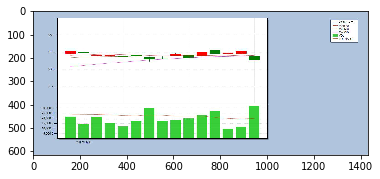

# 巨量資料教我們的: 一命二運三風水。

### 組員: 葉登元、洪志穎、徐上元。 
### 指導教授: 高啟昌 老師。

# 前言

### 孔子曰:不知命，無以為君子也。 

#### 這裡的命，從大方面來講包括天命，指上天意和 民族、國家的命運，從小方面來講，就是指個人的命運。
#### 命是車，運是路。命運如舟與水。
#### 所謂的運，意旨所謂的環境造成的變化，攸關於市場波動與眾人心理，因此我們納入VIX指數。
#### 所謂的風水，意旨事與物之相對位置，我們納入cnn來預測k線圖。

# PART1
## 利用台股VIX指數估計台指期的報酬。
# 並探討VIX高低和台指期交易量。

# PART2

## 使用cnn預測(2330台積電)之k線圖。

# ---------------------------------------------

# PART1

## 載入模組
## 套件需求: pandas，sklearn中的RandomForest分類、回歸、交叉驗證。


```python
from sklearn.ensemble import RandomForestClassifier
from sklearn.model_selection import cross_val_score
from sklearn.linear_model import LinearRegression

import pandas as pd
```

# 讀取檔案
## 資料來源於TEJ
## 台指期貨標的VIX指數 & 台指期

## 期間為:2017/6/19~2018/6/15 將資料切為測試與訓練資料，
## 測試資料為2017/6/19到2018/6/15。訓練資料為2018年6/15倒回去2017年6/19。
## 並修改訓練與測試資料欄位名稱為: VIX、VIX日期、VIX開盤價、VIX最高價、VIX最低價、VIX收盤價、台指期名稱、台指期日期、台指期報酬、台指期收盤、台指期成交量。


```python
test = pd.read_csv("test.csv", error_bad_lines=False)
train = pd.read_csv("train.csv", error_bad_lines=False)
#submit = pd.read_csv('gender_submission.csv')
```

# 改欄位名


```python
train.columns=['vix','vix_date','vix_open','vix_high','vix_low','vix_close','future','fu_date','fu_ret','fu_colse','fu_vol']

```

# 查看資料型態


```python
train.head()
```


<div>
<style>
    .dataframe thead tr:only-child th {
        text-align: right;
    }

    .dataframe thead th {
        text-align: left;
    }

    .dataframe tbody tr th {
        vertical-align: top;
    }
</style>
<table border="1" class="dataframe">
  <thead>
    <tr style="text-align: right;">
      <th></th>
      <th>vix</th>
      <th>vix_date</th>
      <th>vix_open</th>
      <th>vix_high</th>
      <th>vix_low</th>
      <th>vix_close</th>
      <th>future</th>
      <th>fu_date</th>
      <th>fu_ret</th>
      <th>fu_colse</th>
      <th>fu_vol</th>
    </tr>
  </thead>
  <tbody>
    <tr>
      <th>0</th>
      <td>TXO_N5</td>
      <td>2018/6/15</td>
      <td>14.21</td>
      <td>14.90</td>
      <td>13.81</td>
      <td>14.13</td>
      <td>TX201806 ??? 2018/06</td>
      <td>2018/6/15</td>
      <td>0.6281</td>
      <td>11055</td>
      <td>145449</td>
    </tr>
    <tr>
      <th>1</th>
      <td>TXO_N5</td>
      <td>2018/6/14</td>
      <td>14.31</td>
      <td>14.35</td>
      <td>13.87</td>
      <td>14.21</td>
      <td>TX201807 ??? 2018/07</td>
      <td>2018/6/15</td>
      <td>0.6052</td>
      <td>10808</td>
      <td>24657</td>
    </tr>
    <tr>
      <th>2</th>
      <td>TXO_N5</td>
      <td>2018/6/13</td>
      <td>14.19</td>
      <td>14.36</td>
      <td>14.01</td>
      <td>14.01</td>
      <td>TX201806 ??? 2018/06</td>
      <td>2018/6/14</td>
      <td>-1.4445</td>
      <td>10985</td>
      <td>143124</td>
    </tr>
    <tr>
      <th>3</th>
      <td>TXO_N5</td>
      <td>2018/6/12</td>
      <td>14.49</td>
      <td>14.55</td>
      <td>14.15</td>
      <td>14.42</td>
      <td>TX201807 ??? 2018/07</td>
      <td>2018/6/14</td>
      <td>-1.3954</td>
      <td>10742</td>
      <td>11364</td>
    </tr>
    <tr>
      <th>4</th>
      <td>TXO_N5</td>
      <td>2018/6/11</td>
      <td>13.86</td>
      <td>14.45</td>
      <td>13.80</td>
      <td>14.45</td>
      <td>TX201806 ??? 2018/06</td>
      <td>2018/6/13</td>
      <td>0.0449</td>
      <td>11146</td>
      <td>114215</td>
    </tr>
  </tbody>
</table>
</div>


```python
test.head()
```


<div>
<style>
    .dataframe thead tr:only-child th {
        text-align: right;
    }

    .dataframe thead th {
        text-align: left;
    }

    .dataframe tbody tr th {
        vertical-align: top;
    }
</style>
<table border="1" class="dataframe">
  <thead>
    <tr style="text-align: right;">
      <th></th>
      <th>vix</th>
      <th>vix_date</th>
      <th>vix_open</th>
      <th>vix_high</th>
      <th>vix_low</th>
      <th>vix_close</th>
      <th>future</th>
      <th>fu_date</th>
      <th>fu_ret</th>
      <th>fu_close</th>
      <th>fu_volum</th>
    </tr>
  </thead>
  <tbody>
    <tr>
      <th>0</th>
      <td>TXO_N5</td>
      <td>20170619</td>
      <td>10.32</td>
      <td>11.02</td>
      <td>9.96</td>
      <td>11.02</td>
      <td>TX201803 ??? 2018/03</td>
      <td>20170619</td>
      <td>1.0289</td>
      <td>9819</td>
      <td>168204</td>
    </tr>
    <tr>
      <th>1</th>
      <td>TXO_N5</td>
      <td>20170620</td>
      <td>9.97</td>
      <td>10.04</td>
      <td>9.71</td>
      <td>9.86</td>
      <td>TX201803 ??? 2018/03</td>
      <td>20170620</td>
      <td>1.0490</td>
      <td>9922</td>
      <td>184342</td>
    </tr>
    <tr>
      <th>2</th>
      <td>TXO_N5</td>
      <td>20170621</td>
      <td>9.88</td>
      <td>10.13</td>
      <td>9.82</td>
      <td>9.93</td>
      <td>TX201803 ??? 2018/03</td>
      <td>20170621</td>
      <td>0.1613</td>
      <td>9938</td>
      <td>180584</td>
    </tr>
    <tr>
      <th>3</th>
      <td>TXO_N5</td>
      <td>20170622</td>
      <td>10.30</td>
      <td>10.38</td>
      <td>9.78</td>
      <td>10.02</td>
      <td>TX201803 ??? 2018/03</td>
      <td>20170622</td>
      <td>0.6239</td>
      <td>10002</td>
      <td>121899</td>
    </tr>
    <tr>
      <th>4</th>
      <td>TXO_N5</td>
      <td>20170623</td>
      <td>9.90</td>
      <td>10.40</td>
      <td>9.80</td>
      <td>10.40</td>
      <td>TX201803 ??? 2018/03</td>
      <td>20170623</td>
      <td>-0.1200</td>
      <td>9988</td>
      <td>105120</td>
    </tr>
  </tbody>
</table>
</div>


## 查看資料型態，探段資料筆數以及型態
## 若有不同需要去遺失值等資料處理


```python
train.info()
```

    <class 'pandas.core.frame.DataFrame'>
    RangeIndex: 936 entries, 0 to 935
    Data columns (total 11 columns):
    vix          455 non-null object
    vix_date     455 non-null object
    vix_open     455 non-null float64
    vix_high     455 non-null float64
    vix_low      455 non-null float64
    vix_close    455 non-null float64
    future       936 non-null object
    fu_date      936 non-null object
    fu_ret       927 non-null float64
    fu_colse     936 non-null int64
    fu_vol       936 non-null int64
    dtypes: float64(5), int64(2), object(4)
    memory usage: 80.5+ KB
    


```python
test.info()
```

    <class 'pandas.core.frame.DataFrame'>
    RangeIndex: 247 entries, 0 to 246
    Data columns (total 11 columns):
    vix          247 non-null object
    vix_date     247 non-null int64
    vix_open     247 non-null float64
    vix_high     247 non-null float64
    vix_low      247 non-null float64
    vix_close    247 non-null float64
    future       247 non-null object
    fu_date      247 non-null int64
    fu_ret       247 non-null float64
    fu_close     247 non-null int64
    fu_volum     247 non-null int64
    dtypes: float64(5), int64(4), object(2)
    memory usage: 21.3+ KB
    

## 查看資料分佈，以方便之後過濾極值


```python
train.describe()
```


<div>
<style>
    .dataframe thead tr:only-child th {
        text-align: right;
    }

    .dataframe thead th {
        text-align: left;
    }

    .dataframe tbody tr th {
        vertical-align: top;
    }
</style>
<table border="1" class="dataframe">
  <thead>
    <tr style="text-align: right;">
      <th></th>
      <th>vix_open</th>
      <th>vix_high</th>
      <th>vix_low</th>
      <th>vix_close</th>
      <th>fu_ret</th>
      <th>fu_colse</th>
      <th>fu_vol</th>
    </tr>
  </thead>
  <tbody>
    <tr>
      <th>count</th>
      <td>455.000000</td>
      <td>455.000000</td>
      <td>455.000000</td>
      <td>455.000000</td>
      <td>927.000000</td>
      <td>936.000000</td>
      <td>936.000000</td>
    </tr>
    <tr>
      <th>mean</th>
      <td>12.448879</td>
      <td>12.922462</td>
      <td>11.987055</td>
      <td>12.365033</td>
      <td>0.064679</td>
      <td>10555.685897</td>
      <td>37793.850427</td>
    </tr>
    <tr>
      <th>std</th>
      <td>3.300000</td>
      <td>4.318183</td>
      <td>2.950731</td>
      <td>3.198237</td>
      <td>0.729217</td>
      <td>279.185047</td>
      <td>59756.884565</td>
    </tr>
    <tr>
      <th>min</th>
      <td>8.080000</td>
      <td>8.190000</td>
      <td>7.730000</td>
      <td>7.820000</td>
      <td>-4.995400</td>
      <td>9819.000000</td>
      <td>17.000000</td>
    </tr>
    <tr>
      <th>25%</th>
      <td>10.250000</td>
      <td>10.455000</td>
      <td>9.945000</td>
      <td>10.140000</td>
      <td>-0.319150</td>
      <td>10335.750000</td>
      <td>279.750000</td>
    </tr>
    <tr>
      <th>50%</th>
      <td>11.480000</td>
      <td>11.910000</td>
      <td>11.160000</td>
      <td>11.530000</td>
      <td>0.117000</td>
      <td>10529.500000</td>
      <td>1749.500000</td>
    </tr>
    <tr>
      <th>75%</th>
      <td>13.715000</td>
      <td>14.015000</td>
      <td>13.270000</td>
      <td>13.805000</td>
      <td>0.497100</td>
      <td>10761.500000</td>
      <td>89802.000000</td>
    </tr>
    <tr>
      <th>max</th>
      <td>34.460000</td>
      <td>57.360000</td>
      <td>29.030000</td>
      <td>30.070000</td>
      <td>2.997600</td>
      <td>11227.000000</td>
      <td>409245.000000</td>
    </tr>
  </tbody>
</table>
</div>


```python
test.describe()
```


<div>
<style>
    .dataframe thead tr:only-child th {
        text-align: right;
    }

    .dataframe thead th {
        text-align: left;
    }

    .dataframe tbody tr th {
        vertical-align: top;
    }
</style>
<table border="1" class="dataframe">
  <thead>
    <tr style="text-align: right;">
      <th></th>
      <th>vix_date</th>
      <th>vix_open</th>
      <th>vix_high</th>
      <th>vix_low</th>
      <th>vix_close</th>
      <th>fu_date</th>
      <th>fu_ret</th>
      <th>fu_close</th>
      <th>fu_volum</th>
    </tr>
  </thead>
  <tbody>
    <tr>
      <th>count</th>
      <td>2.470000e+02</td>
      <td>247.000000</td>
      <td>247.000000</td>
      <td>247.000000</td>
      <td>247.000000</td>
      <td>2.470000e+02</td>
      <td>247.000000</td>
      <td>247.000000</td>
      <td>247.000000</td>
    </tr>
    <tr>
      <th>mean</th>
      <td>2.017509e+07</td>
      <td>13.104737</td>
      <td>13.622834</td>
      <td>12.649717</td>
      <td>13.116842</td>
      <td>2.017509e+07</td>
      <td>0.057362</td>
      <td>10548.178138</td>
      <td>143502.190283</td>
    </tr>
    <tr>
      <th>std</th>
      <td>4.685796e+03</td>
      <td>3.347928</td>
      <td>4.255705</td>
      <td>2.930674</td>
      <td>3.245273</td>
      <td>4.685796e+03</td>
      <td>0.774394</td>
      <td>286.091933</td>
      <td>39598.891933</td>
    </tr>
    <tr>
      <th>min</th>
      <td>2.017062e+07</td>
      <td>8.440000</td>
      <td>8.860000</td>
      <td>7.820000</td>
      <td>7.820000</td>
      <td>2.017062e+07</td>
      <td>-4.995400</td>
      <td>9819.000000</td>
      <td>24665.000000</td>
    </tr>
    <tr>
      <th>25%</th>
      <td>2.017091e+07</td>
      <td>10.915000</td>
      <td>11.245000</td>
      <td>10.615000</td>
      <td>10.945000</td>
      <td>2.017091e+07</td>
      <td>-0.351200</td>
      <td>10331.000000</td>
      <td>119712.000000</td>
    </tr>
    <tr>
      <th>50%</th>
      <td>2.017121e+07</td>
      <td>12.090000</td>
      <td>12.530000</td>
      <td>11.780000</td>
      <td>12.150000</td>
      <td>2.017121e+07</td>
      <td>0.113100</td>
      <td>10580.000000</td>
      <td>139254.000000</td>
    </tr>
    <tr>
      <th>75%</th>
      <td>2.018032e+07</td>
      <td>14.350000</td>
      <td>14.780000</td>
      <td>13.785000</td>
      <td>14.165000</td>
      <td>2.018032e+07</td>
      <td>0.510700</td>
      <td>10758.500000</td>
      <td>166639.500000</td>
    </tr>
    <tr>
      <th>max</th>
      <td>2.018062e+07</td>
      <td>34.460000</td>
      <td>54.920000</td>
      <td>25.300000</td>
      <td>30.070000</td>
      <td>2.018062e+07</td>
      <td>2.982800</td>
      <td>11161.000000</td>
      <td>433346.000000</td>
    </tr>
  </tbody>
</table>
</div>


# 計算技術指標
## 我們願使用KD、MACD、RSI技術指標的值當作分類依據，
## 因此需載numpy、talib，技術指標於talib運算後與之前欄位項目一同匯入t1，
## 並移除空值與遺漏值
## 其中利用技術指標是採用VIX指數來做為計算
## 想看看以往都是利用股價計算去做的技術指標在VIX終能否適用


```python
import talib
import numpy
def talib2df(talib_output):
    if type(talib_output) == list:
        ret = pd.DataFrame(talib_output).transpose()
    else:
        ret = pd.Series(talib_output)
    ret.index = test['vix_close'].index
    return ret;
```


```python
t1 = {
    'close':test.vix_close.dropna().astype(float),
    'open':test.vix_open.dropna().astype(float),
    'high':test.vix_high.dropna().astype(float),
    'low':test.vix_low.dropna().astype(float),
    'volume': test.fu_volum.dropna().astype(float)    
}
```

# 採用 KD/MACD/RSI指標


```python
KD = talib2df(talib.abstract.STOCH(t1, fastk_period=9))
```


```python
MACD = talib2df(talib.abstract.MACD(t1))
```


```python
RSI = talib2df(talib.abstract.RSI(t1))
```


```python
t1=pd.DataFrame(t1)
t1 = pd.concat([test,KD,MACD,RSI], axis=1)
```


```python
t1.columns=['vix','vix_date','vix_open','vix_high','vix_low','vix_close','future','fu_date','fu_ret','fu_colse','fu_vol','k','d','dif12','dif26','macd','rsi']
```


```python
t1.head(50)
```


<div>
<style>
    .dataframe thead tr:only-child th {
        text-align: right;
    }

    .dataframe thead th {
        text-align: left;
    }

    .dataframe tbody tr th {
        vertical-align: top;
    }
</style>
<table border="1" class="dataframe">
  <thead>
    <tr style="text-align: right;">
      <th></th>
      <th>vix</th>
      <th>vix_date</th>
      <th>vix_open</th>
      <th>vix_high</th>
      <th>vix_low</th>
      <th>vix_close</th>
      <th>future</th>
      <th>fu_date</th>
      <th>fu_ret</th>
      <th>fu_colse</th>
      <th>fu_vol</th>
      <th>k</th>
      <th>d</th>
      <th>dif12</th>
      <th>dif26</th>
      <th>macd</th>
      <th>rsi</th>
    </tr>
  </thead>
  <tbody>
    <tr>
      <th>0</th>
      <td>TXO_N5</td>
      <td>20170619</td>
      <td>10.32</td>
      <td>11.02</td>
      <td>9.96</td>
      <td>11.02</td>
      <td>TX201803 ??? 2018/03</td>
      <td>20170619</td>
      <td>1.0289</td>
      <td>9819</td>
      <td>168204</td>
      <td>NaN</td>
      <td>NaN</td>
      <td>NaN</td>
      <td>NaN</td>
      <td>NaN</td>
      <td>NaN</td>
    </tr>
    <tr>
      <th>1</th>
      <td>TXO_N5</td>
      <td>20170620</td>
      <td>9.97</td>
      <td>10.04</td>
      <td>9.71</td>
      <td>9.86</td>
      <td>TX201803 ??? 2018/03</td>
      <td>20170620</td>
      <td>1.0490</td>
      <td>9922</td>
      <td>184342</td>
      <td>NaN</td>
      <td>NaN</td>
      <td>NaN</td>
      <td>NaN</td>
      <td>NaN</td>
      <td>NaN</td>
    </tr>
    <tr>
      <th>2</th>
      <td>TXO_N5</td>
      <td>20170621</td>
      <td>9.88</td>
      <td>10.13</td>
      <td>9.82</td>
      <td>9.93</td>
      <td>TX201803 ??? 2018/03</td>
      <td>20170621</td>
      <td>0.1613</td>
      <td>9938</td>
      <td>180584</td>
      <td>NaN</td>
      <td>NaN</td>
      <td>NaN</td>
      <td>NaN</td>
      <td>NaN</td>
      <td>NaN</td>
    </tr>
    <tr>
      <th>3</th>
      <td>TXO_N5</td>
      <td>20170622</td>
      <td>10.30</td>
      <td>10.38</td>
      <td>9.78</td>
      <td>10.02</td>
      <td>TX201803 ??? 2018/03</td>
      <td>20170622</td>
      <td>0.6239</td>
      <td>10002</td>
      <td>121899</td>
      <td>NaN</td>
      <td>NaN</td>
      <td>NaN</td>
      <td>NaN</td>
      <td>NaN</td>
      <td>NaN</td>
    </tr>
    <tr>
      <th>4</th>
      <td>TXO_N5</td>
      <td>20170623</td>
      <td>9.90</td>
      <td>10.40</td>
      <td>9.80</td>
      <td>10.40</td>
      <td>TX201803 ??? 2018/03</td>
      <td>20170623</td>
      <td>-0.1200</td>
      <td>9988</td>
      <td>105120</td>
      <td>NaN</td>
      <td>NaN</td>
      <td>NaN</td>
      <td>NaN</td>
      <td>NaN</td>
      <td>NaN</td>
    </tr>
    <tr>
      <th>5</th>
      <td>TXO_N5</td>
      <td>20170626</td>
      <td>10.39</td>
      <td>12.17</td>
      <td>10.32</td>
      <td>12.17</td>
      <td>TX201803 ??? 2018/03</td>
      <td>20170626</td>
      <td>2.1526</td>
      <td>10203</td>
      <td>195349</td>
      <td>NaN</td>
      <td>NaN</td>
      <td>NaN</td>
      <td>NaN</td>
      <td>NaN</td>
      <td>NaN</td>
    </tr>
    <tr>
      <th>6</th>
      <td>TXO_N5</td>
      <td>20170627</td>
      <td>11.89</td>
      <td>12.55</td>
      <td>11.75</td>
      <td>12.12</td>
      <td>TX201803 ??? 2018/03</td>
      <td>20170627</td>
      <td>-0.1078</td>
      <td>10192</td>
      <td>121428</td>
      <td>NaN</td>
      <td>NaN</td>
      <td>NaN</td>
      <td>NaN</td>
      <td>NaN</td>
      <td>NaN</td>
    </tr>
    <tr>
      <th>7</th>
      <td>TXO_N5</td>
      <td>20170628</td>
      <td>12.48</td>
      <td>12.60</td>
      <td>12.25</td>
      <td>12.52</td>
      <td>TX201803 ??? 2018/03</td>
      <td>20170628</td>
      <td>-1.0302</td>
      <td>10087</td>
      <td>165922</td>
      <td>NaN</td>
      <td>NaN</td>
      <td>NaN</td>
      <td>NaN</td>
      <td>NaN</td>
      <td>NaN</td>
    </tr>
    <tr>
      <th>8</th>
      <td>TXO_N5</td>
      <td>20170629</td>
      <td>12.38</td>
      <td>12.38</td>
      <td>11.79</td>
      <td>11.84</td>
      <td>TX201803 ??? 2018/03</td>
      <td>20170629</td>
      <td>0.2677</td>
      <td>10115</td>
      <td>134893</td>
      <td>NaN</td>
      <td>NaN</td>
      <td>NaN</td>
      <td>NaN</td>
      <td>NaN</td>
      <td>NaN</td>
    </tr>
    <tr>
      <th>9</th>
      <td>TXO_N5</td>
      <td>20170630</td>
      <td>12.76</td>
      <td>12.76</td>
      <td>12.11</td>
      <td>12.33</td>
      <td>TX201712 ??? 2017/12</td>
      <td>20170630</td>
      <td>-0.4141</td>
      <td>10103</td>
      <td>129676</td>
      <td>NaN</td>
      <td>NaN</td>
      <td>NaN</td>
      <td>NaN</td>
      <td>NaN</td>
      <td>NaN</td>
    </tr>
    <tr>
      <th>10</th>
      <td>TXO_N5</td>
      <td>20170703</td>
      <td>12.62</td>
      <td>13.01</td>
      <td>12.05</td>
      <td>12.07</td>
      <td>TX201803 ??? 2018/03</td>
      <td>20170703</td>
      <td>0.3078</td>
      <td>10101</td>
      <td>109556</td>
      <td>NaN</td>
      <td>NaN</td>
      <td>NaN</td>
      <td>NaN</td>
      <td>NaN</td>
      <td>NaN</td>
    </tr>
    <tr>
      <th>11</th>
      <td>TXO_N5</td>
      <td>20170704</td>
      <td>11.98</td>
      <td>12.16</td>
      <td>11.80</td>
      <td>12.10</td>
      <td>TX201803 ??? 2018/03</td>
      <td>20170704</td>
      <td>-0.7029</td>
      <td>10030</td>
      <td>143772</td>
      <td>NaN</td>
      <td>NaN</td>
      <td>NaN</td>
      <td>NaN</td>
      <td>NaN</td>
      <td>NaN</td>
    </tr>
    <tr>
      <th>12</th>
      <td>TXO_N5</td>
      <td>20170705</td>
      <td>11.98</td>
      <td>12.17</td>
      <td>11.57</td>
      <td>12.17</td>
      <td>TX201803 ??? 2018/03</td>
      <td>20170705</td>
      <td>0.7278</td>
      <td>10103</td>
      <td>172653</td>
      <td>72.185411</td>
      <td>75.076025</td>
      <td>NaN</td>
      <td>NaN</td>
      <td>NaN</td>
      <td>NaN</td>
    </tr>
    <tr>
      <th>13</th>
      <td>TXO_N5</td>
      <td>20170706</td>
      <td>11.96</td>
      <td>12.42</td>
      <td>11.94</td>
      <td>12.23</td>
      <td>TX201803 ??? 2018/03</td>
      <td>20170706</td>
      <td>-0.3563</td>
      <td>10067</td>
      <td>134041</td>
      <td>72.220706</td>
      <td>73.538272</td>
      <td>NaN</td>
      <td>NaN</td>
      <td>NaN</td>
      <td>NaN</td>
    </tr>
    <tr>
      <th>14</th>
      <td>TXO_N5</td>
      <td>20170707</td>
      <td>12.51</td>
      <td>12.69</td>
      <td>12.40</td>
      <td>12.40</td>
      <td>TX201803 ??? 2018/03</td>
      <td>20170707</td>
      <td>-0.5761</td>
      <td>10009</td>
      <td>123496</td>
      <td>67.491461</td>
      <td>70.632526</td>
      <td>NaN</td>
      <td>NaN</td>
      <td>NaN</td>
      <td>62.147887</td>
    </tr>
    <tr>
      <th>15</th>
      <td>TXO_N5</td>
      <td>20170710</td>
      <td>12.82</td>
      <td>12.83</td>
      <td>12.31</td>
      <td>12.31</td>
      <td>TX201803 ??? 2018/03</td>
      <td>20170710</td>
      <td>0.0599</td>
      <td>10015</td>
      <td>114699</td>
      <td>60.010498</td>
      <td>66.574222</td>
      <td>NaN</td>
      <td>NaN</td>
      <td>NaN</td>
      <td>61.105193</td>
    </tr>
    <tr>
      <th>16</th>
      <td>TXO_N5</td>
      <td>20170711</td>
      <td>12.17</td>
      <td>12.17</td>
      <td>11.68</td>
      <td>11.72</td>
      <td>TX201803 ??? 2018/03</td>
      <td>20170711</td>
      <td>1.3480</td>
      <td>10150</td>
      <td>149796</td>
      <td>39.814815</td>
      <td>55.772258</td>
      <td>NaN</td>
      <td>NaN</td>
      <td>NaN</td>
      <td>54.633954</td>
    </tr>
    <tr>
      <th>17</th>
      <td>TXO_N5</td>
      <td>20170712</td>
      <td>11.81</td>
      <td>11.92</td>
      <td>11.68</td>
      <td>11.80</td>
      <td>TX201803 ??? 2018/03</td>
      <td>20170712</td>
      <td>-0.0788</td>
      <td>10142</td>
      <td>119813</td>
      <td>25.925926</td>
      <td>41.917080</td>
      <td>NaN</td>
      <td>NaN</td>
      <td>NaN</td>
      <td>55.324827</td>
    </tr>
    <tr>
      <th>18</th>
      <td>TXO_N5</td>
      <td>20170713</td>
      <td>11.86</td>
      <td>11.91</td>
      <td>11.43</td>
      <td>11.53</td>
      <td>TX201803 ??? 2018/03</td>
      <td>20170713</td>
      <td>0.7888</td>
      <td>10222</td>
      <td>155889</td>
      <td>10.906001</td>
      <td>25.548914</td>
      <td>NaN</td>
      <td>NaN</td>
      <td>NaN</td>
      <td>52.423152</td>
    </tr>
    <tr>
      <th>19</th>
      <td>TXO_N5</td>
      <td>20170714</td>
      <td>11.54</td>
      <td>11.60</td>
      <td>11.14</td>
      <td>11.19</td>
      <td>TX201803 ??? 2018/03</td>
      <td>20170714</td>
      <td>-0.1467</td>
      <td>10207</td>
      <td>89843</td>
      <td>8.419972</td>
      <td>15.083966</td>
      <td>NaN</td>
      <td>NaN</td>
      <td>NaN</td>
      <td>48.942094</td>
    </tr>
    <tr>
      <th>20</th>
      <td>TXO_N5</td>
      <td>20170717</td>
      <td>11.43</td>
      <td>12.09</td>
      <td>11.16</td>
      <td>12.09</td>
      <td>TX201803 ??? 2018/03</td>
      <td>20170717</td>
      <td>0.2253</td>
      <td>10230</td>
      <td>178952</td>
      <td>21.833571</td>
      <td>13.719848</td>
      <td>NaN</td>
      <td>NaN</td>
      <td>NaN</td>
      <td>57.068719</td>
    </tr>
    <tr>
      <th>21</th>
      <td>TXO_N5</td>
      <td>20170718</td>
      <td>11.12</td>
      <td>12.10</td>
      <td>10.94</td>
      <td>12.10</td>
      <td>TX201803 ??? 2018/03</td>
      <td>20170718</td>
      <td>0.2639</td>
      <td>10257</td>
      <td>132979</td>
      <td>40.182420</td>
      <td>23.478654</td>
      <td>NaN</td>
      <td>NaN</td>
      <td>NaN</td>
      <td>57.150327</td>
    </tr>
    <tr>
      <th>22</th>
      <td>TXO_N5</td>
      <td>20170719</td>
      <td>10.96</td>
      <td>11.68</td>
      <td>10.84</td>
      <td>11.26</td>
      <td>TX201803 ??? 2018/03</td>
      <td>20170719</td>
      <td>0.3900</td>
      <td>10297</td>
      <td>155196</td>
      <td>46.231402</td>
      <td>36.082464</td>
      <td>NaN</td>
      <td>NaN</td>
      <td>NaN</td>
      <td>48.764750</td>
    </tr>
    <tr>
      <th>23</th>
      <td>TXO_N5</td>
      <td>20170720</td>
      <td>10.76</td>
      <td>10.76</td>
      <td>10.48</td>
      <td>10.48</td>
      <td>TX201806 ??? 2018/06</td>
      <td>20170720</td>
      <td>0.0000</td>
      <td>10275</td>
      <td>95765</td>
      <td>27.493730</td>
      <td>37.969184</td>
      <td>NaN</td>
      <td>NaN</td>
      <td>NaN</td>
      <td>42.525107</td>
    </tr>
    <tr>
      <th>24</th>
      <td>TXO_N5</td>
      <td>20170721</td>
      <td>10.53</td>
      <td>10.71</td>
      <td>10.34</td>
      <td>10.54</td>
      <td>TX201806 ??? 2018/06</td>
      <td>20170721</td>
      <td>-0.6326</td>
      <td>10210</td>
      <td>99432</td>
      <td>10.678163</td>
      <td>28.134432</td>
      <td>NaN</td>
      <td>NaN</td>
      <td>NaN</td>
      <td>43.127936</td>
    </tr>
    <tr>
      <th>25</th>
      <td>TXO_N5</td>
      <td>20170724</td>
      <td>10.95</td>
      <td>10.99</td>
      <td>10.41</td>
      <td>10.58</td>
      <td>TX201806 ??? 2018/06</td>
      <td>20170724</td>
      <td>0.1763</td>
      <td>10228</td>
      <td>99477</td>
      <td>8.188442</td>
      <td>15.453445</td>
      <td>NaN</td>
      <td>NaN</td>
      <td>NaN</td>
      <td>43.552996</td>
    </tr>
    <tr>
      <th>26</th>
      <td>TXO_N5</td>
      <td>20170725</td>
      <td>10.58</td>
      <td>10.70</td>
      <td>10.32</td>
      <td>10.70</td>
      <td>TX201806 ??? 2018/06</td>
      <td>20170725</td>
      <td>0.0489</td>
      <td>10233</td>
      <td>93023</td>
      <td>15.304547</td>
      <td>11.390384</td>
      <td>NaN</td>
      <td>NaN</td>
      <td>NaN</td>
      <td>44.883867</td>
    </tr>
    <tr>
      <th>27</th>
      <td>TXO_N5</td>
      <td>20170726</td>
      <td>10.30</td>
      <td>10.32</td>
      <td>10.10</td>
      <td>10.20</td>
      <td>TX201806 ??? 2018/06</td>
      <td>20170726</td>
      <td>-0.4691</td>
      <td>10185</td>
      <td>143458</td>
      <td>13.328226</td>
      <td>12.273738</td>
      <td>NaN</td>
      <td>NaN</td>
      <td>NaN</td>
      <td>40.589652</td>
    </tr>
    <tr>
      <th>28</th>
      <td>TXO_N5</td>
      <td>20170727</td>
      <td>10.03</td>
      <td>10.09</td>
      <td>9.73</td>
      <td>9.92</td>
      <td>TX201806 ??? 2018/06</td>
      <td>20170727</td>
      <td>1.1095</td>
      <td>10298</td>
      <td>135687</td>
      <td>11.455064</td>
      <td>13.362612</td>
      <td>NaN</td>
      <td>NaN</td>
      <td>NaN</td>
      <td>38.375439</td>
    </tr>
    <tr>
      <th>29</th>
      <td>TXO_N5</td>
      <td>20170728</td>
      <td>10.02</td>
      <td>10.50</td>
      <td>10.02</td>
      <td>10.50</td>
      <td>TX201806 ??? 2018/06</td>
      <td>20170728</td>
      <td>-1.0293</td>
      <td>10192</td>
      <td>132484</td>
      <td>15.168776</td>
      <td>13.317356</td>
      <td>NaN</td>
      <td>NaN</td>
      <td>NaN</td>
      <td>45.061024</td>
    </tr>
    <tr>
      <th>30</th>
      <td>TXO_N5</td>
      <td>20170731</td>
      <td>10.56</td>
      <td>10.90</td>
      <td>10.24</td>
      <td>10.90</td>
      <td>TX201806 ??? 2018/06</td>
      <td>20170731</td>
      <td>0.1374</td>
      <td>10206</td>
      <td>111093</td>
      <td>33.502110</td>
      <td>20.041983</td>
      <td>NaN</td>
      <td>NaN</td>
      <td>NaN</td>
      <td>49.157663</td>
    </tr>
    <tr>
      <th>31</th>
      <td>TXO_N5</td>
      <td>20170801</td>
      <td>10.23</td>
      <td>10.96</td>
      <td>10.15</td>
      <td>10.26</td>
      <td>TX201806 ??? 2018/06</td>
      <td>20170801</td>
      <td>0.0784</td>
      <td>10214</td>
      <td>128371</td>
      <td>44.850981</td>
      <td>31.173956</td>
      <td>NaN</td>
      <td>NaN</td>
      <td>NaN</td>
      <td>43.560766</td>
    </tr>
    <tr>
      <th>32</th>
      <td>TXO_N5</td>
      <td>20170802</td>
      <td>10.25</td>
      <td>14.83</td>
      <td>10.16</td>
      <td>14.83</td>
      <td>TX201806 ??? 2018/06</td>
      <td>20170802</td>
      <td>0.7539</td>
      <td>10291</td>
      <td>123147</td>
      <td>67.354497</td>
      <td>48.569196</td>
      <td>NaN</td>
      <td>NaN</td>
      <td>NaN</td>
      <td>69.907775</td>
    </tr>
    <tr>
      <th>33</th>
      <td>TXO_N5</td>
      <td>20170803</td>
      <td>18.90</td>
      <td>18.90</td>
      <td>10.80</td>
      <td>10.96</td>
      <td>TX201806 ??? 2018/06</td>
      <td>20170803</td>
      <td>-0.4567</td>
      <td>10244</td>
      <td>139493</td>
      <td>51.825599</td>
      <td>54.677026</td>
      <td>0.021543</td>
      <td>-0.124580</td>
      <td>0.146123</td>
      <td>49.033124</td>
    </tr>
    <tr>
      <th>34</th>
      <td>TXO_N5</td>
      <td>20170804</td>
      <td>11.27</td>
      <td>11.43</td>
      <td>11.22</td>
      <td>11.40</td>
      <td>TX201806 ??? 2018/06</td>
      <td>20170804</td>
      <td>0.2831</td>
      <td>10273</td>
      <td>85938</td>
      <td>43.874955</td>
      <td>54.351684</td>
      <td>0.022980</td>
      <td>-0.095068</td>
      <td>0.118048</td>
      <td>50.830807</td>
    </tr>
    <tr>
      <th>35</th>
      <td>TXO_N5</td>
      <td>20170807</td>
      <td>11.44</td>
      <td>11.51</td>
      <td>11.10</td>
      <td>11.33</td>
      <td>TX201806 ??? 2018/06</td>
      <td>20170807</td>
      <td>0.8274</td>
      <td>10358</td>
      <td>95562</td>
      <td>16.357688</td>
      <td>37.352747</td>
      <td>0.018261</td>
      <td>-0.072402</td>
      <td>0.090663</td>
      <td>50.525480</td>
    </tr>
    <tr>
      <th>36</th>
      <td>TXO_N5</td>
      <td>20170808</td>
      <td>11.12</td>
      <td>11.44</td>
      <td>10.98</td>
      <td>11.41</td>
      <td>TX201806 ??? 2018/06</td>
      <td>20170808</td>
      <td>-0.1255</td>
      <td>10345</td>
      <td>121843</td>
      <td>17.993457</td>
      <td>26.075367</td>
      <td>0.020736</td>
      <td>-0.053774</td>
      <td>0.074511</td>
      <td>50.888556</td>
    </tr>
    <tr>
      <th>37</th>
      <td>TXO_N5</td>
      <td>20170809</td>
      <td>11.99</td>
      <td>12.49</td>
      <td>11.99</td>
      <td>12.15</td>
      <td>TX201806 ??? 2018/06</td>
      <td>20170809</td>
      <td>-0.6380</td>
      <td>10279</td>
      <td>145957</td>
      <td>19.918433</td>
      <td>18.089859</td>
      <td>0.081471</td>
      <td>-0.026725</td>
      <td>0.108197</td>
      <td>54.234230</td>
    </tr>
    <tr>
      <th>38</th>
      <td>TXO_N5</td>
      <td>20170810</td>
      <td>11.79</td>
      <td>13.39</td>
      <td>11.75</td>
      <td>13.23</td>
      <td>TX201806 ??? 2018/06</td>
      <td>20170810</td>
      <td>-1.1577</td>
      <td>10160</td>
      <td>202500</td>
      <td>25.835699</td>
      <td>21.249196</td>
      <td>0.214281</td>
      <td>0.021476</td>
      <td>0.192805</td>
      <td>58.660546</td>
    </tr>
    <tr>
      <th>39</th>
      <td>TXO_N5</td>
      <td>20170811</td>
      <td>14.74</td>
      <td>15.23</td>
      <td>14.18</td>
      <td>14.38</td>
      <td>TX201803 ??? 2018/03</td>
      <td>20170811</td>
      <td>-0.3133</td>
      <td>10182</td>
      <td>161301</td>
      <td>35.843115</td>
      <td>27.199082</td>
      <td>0.407630</td>
      <td>0.098707</td>
      <td>0.308923</td>
      <td>62.787668</td>
    </tr>
    <tr>
      <th>40</th>
      <td>TXO_N5</td>
      <td>20170814</td>
      <td>13.34</td>
      <td>14.03</td>
      <td>13.34</td>
      <td>13.87</td>
      <td>TX201806 ??? 2018/06</td>
      <td>20170814</td>
      <td>-0.7994</td>
      <td>10052</td>
      <td>216354</td>
      <td>41.997123</td>
      <td>34.558646</td>
      <td>0.513785</td>
      <td>0.181722</td>
      <td>0.332063</td>
      <td>59.930175</td>
    </tr>
    <tr>
      <th>41</th>
      <td>TXO_N5</td>
      <td>20170815</td>
      <td>13.50</td>
      <td>13.51</td>
      <td>13.05</td>
      <td>13.05</td>
      <td>TX201806 ??? 2018/06</td>
      <td>20170815</td>
      <td>0.7163</td>
      <td>10124</td>
      <td>191986</td>
      <td>39.523049</td>
      <td>39.121096</td>
      <td>0.525687</td>
      <td>0.250515</td>
      <td>0.275172</td>
      <td>55.552508</td>
    </tr>
    <tr>
      <th>42</th>
      <td>TXO_N5</td>
      <td>20170816</td>
      <td>13.09</td>
      <td>15.16</td>
      <td>12.76</td>
      <td>12.77</td>
      <td>TX201806 ??? 2018/06</td>
      <td>20170816</td>
      <td>-0.2864</td>
      <td>10095</td>
      <td>187408</td>
      <td>37.447979</td>
      <td>39.656051</td>
      <td>0.506685</td>
      <td>0.301749</td>
      <td>0.204936</td>
      <td>54.099332</td>
    </tr>
    <tr>
      <th>43</th>
      <td>TXO_N5</td>
      <td>20170817</td>
      <td>12.45</td>
      <td>12.53</td>
      <td>11.67</td>
      <td>11.98</td>
      <td>TX201806 ??? 2018/06</td>
      <td>20170817</td>
      <td>0.5547</td>
      <td>10151</td>
      <td>127147</td>
      <td>31.141612</td>
      <td>36.037547</td>
      <td>0.423003</td>
      <td>0.326000</td>
      <td>0.097003</td>
      <td>50.116018</td>
    </tr>
    <tr>
      <th>44</th>
      <td>TXO_N5</td>
      <td>20170818</td>
      <td>12.87</td>
      <td>13.35</td>
      <td>12.39</td>
      <td>12.67</td>
      <td>TX201806 ??? 2018/06</td>
      <td>20170818</td>
      <td>-0.3448</td>
      <td>10116</td>
      <td>145088</td>
      <td>35.137255</td>
      <td>34.575615</td>
      <td>0.407663</td>
      <td>0.342333</td>
      <td>0.065330</td>
      <td>53.347031</td>
    </tr>
    <tr>
      <th>45</th>
      <td>TXO_N5</td>
      <td>20170821</td>
      <td>13.03</td>
      <td>13.26</td>
      <td>12.72</td>
      <td>13.03</td>
      <td>TX201806 ??? 2018/06</td>
      <td>20170821</td>
      <td>0.0000</td>
      <td>10116</td>
      <td>112143</td>
      <td>33.832122</td>
      <td>33.370330</td>
      <td>0.419716</td>
      <td>0.357809</td>
      <td>0.061907</td>
      <td>54.985244</td>
    </tr>
    <tr>
      <th>46</th>
      <td>TXO_N5</td>
      <td>20170822</td>
      <td>12.85</td>
      <td>12.85</td>
      <td>11.84</td>
      <td>12.08</td>
      <td>TX201806 ??? 2018/06</td>
      <td>20170822</td>
      <td>0.7711</td>
      <td>10194</td>
      <td>114930</td>
      <td>29.827936</td>
      <td>32.932437</td>
      <td>0.348593</td>
      <td>0.355966</td>
      <td>-0.007373</td>
      <td>49.996026</td>
    </tr>
    <tr>
      <th>47</th>
      <td>TXO_N5</td>
      <td>20170823</td>
      <td>11.52</td>
      <td>11.81</td>
      <td>11.47</td>
      <td>11.75</td>
      <td>TX201806 ??? 2018/06</td>
      <td>20170823</td>
      <td>0.1275</td>
      <td>10207</td>
      <td>136761</td>
      <td>19.055303</td>
      <td>27.571787</td>
      <td>0.262572</td>
      <td>0.337287</td>
      <td>-0.074715</td>
      <td>48.354680</td>
    </tr>
    <tr>
      <th>48</th>
      <td>TXO_N5</td>
      <td>20170824</td>
      <td>11.52</td>
      <td>11.55</td>
      <td>11.18</td>
      <td>11.35</td>
      <td>TX201806 ??? 2018/06</td>
      <td>20170824</td>
      <td>0.7740</td>
      <td>10286</td>
      <td>121528</td>
      <td>7.745006</td>
      <td>18.876082</td>
      <td>0.160276</td>
      <td>0.301885</td>
      <td>-0.141609</td>
      <td>46.367625</td>
    </tr>
    <tr>
      <th>49</th>
      <td>TXO_N5</td>
      <td>20170825</td>
      <td>11.22</td>
      <td>11.50</td>
      <td>11.10</td>
      <td>11.29</td>
      <td>TX201806 ??? 2018/06</td>
      <td>20170825</td>
      <td>0.3889</td>
      <td>10326</td>
      <td>109142</td>
      <td>5.465989</td>
      <td>10.755433</td>
      <td>0.073517</td>
      <td>0.256211</td>
      <td>-0.182695</td>
      <td>46.061859</td>
    </tr>
  </tbody>
</table>
</div>


# 移除空值(由於技術指標計算後前幾天會有空值情況)
## 沒有移除會有錯誤產生


```python
t1 = t1.query('vix_date > 20170803')
```

### 先載入sklearn的模型選擇、預先處理、指標與ensemble模型後我們開始進行分類。
### 我們將(交易量增加的)、(報酬率>0)、(波動率指數增加的)設為1; 因為想要用類別(不是連續)的變數，
### 因此需要載入虛擬變數(dummy variables)，最後測試並建立volume的數據。


```python
import numpy as np

from sklearn import model_selection, ensemble, preprocessing, metrics
```

### 移除遺漏值、與設交易量增加&報酬大於零&VIX指數上漲  為 1


```python
df=t1
df['pre_vol']=(df.fu_vol - df.fu_vol.shift(1)) > 0
df['pre_ret']=(df.fu_ret -  0 ) > 0
df['pre_vix_close']=(df.vix_close - df.vix_close.shift(1)) > 0

df=df.dropna()
```

### 創造 dummy variables


```python
label_encoder = preprocessing.LabelEncoder()
encoded_label = label_encoder.fit_transform(df["future"])
encoded_label2 = label_encoder.fit_transform(df["vix"])
df['future']= encoded_label
df['vix'] = encoded_label2
```

### 測試還有建立的數據_VOLUME


```python
selected_features = ['vix_date','vix_open','vix_high','vix_low','vix_close','fu_vol','k','d','macd','rsi','fu_ret','future']
pre_vol_X = df[selected_features]
pre_vol_y = df['pre_vol']
train_X, test_X, train_y, test_y = model_selection.train_test_split(pre_vol_X, pre_vol_y, test_size = 0.3)
```

### 接下來我們載入 random forest 模型並進行預測


```python
forest = ensemble.RandomForestClassifier(n_estimators = 300)
forest_fit = forest.fit(train_X, train_y)
```

### 預測


```python
test_y_predicted = forest.predict(test_X)
#test_y_predicted
```

### 績效


```python
accuracy = metrics.accuracy_score(test_y, test_y_predicted)
#print(accuracy)
fpr, tpr, thresholds = metrics.roc_curve(test_y, test_y_predicted)
auc = metrics.auc(fpr, tpr)
#print(auc)
print('準確率: {}'.format(auc))
print('AUC值: {}'.format(accuracy))
```

    準確率: 0.6533333333333334
    AUC值: 0.65625
    

## 預測期貨交易量


```python
import numpy as np
today_X = df[selected_features]
today_y_predicted = forest.predict(today_X)
proba = forest.predict_proba(today_X)
```


```python
print('隔日交易量: ' + format(np.where(today_y_predicted==True,'增','減')[0]))
print( '明日增加的機率: {}'.format(proba[0][1]))
```

    隔日交易量: 減
    明日增加的機率: 0.15666666666666668
    

## 建立預測報酬ret


```python
selected_features_ret = ['vix_date','fu_date','vix_high','vix_low','fu_vol','k','d','macd','rsi','future']
pre_ret_X = df[selected_features_ret]
pre_ret_y = df['pre_ret']
train_X2, test_X2, train_y2, test_y2 = model_selection.train_test_split(pre_ret_X, pre_ret_y, test_size = 0.3)
```


```python
forest = ensemble.RandomForestClassifier(n_estimators = 100)
forest_fit = forest.fit(train_X2, train_y2)
```


```python
test_y2_predicted = forest.predict(test_X2)
```


```python
accuracy = metrics.accuracy_score(test_y2, test_y2_predicted)
#print(accuracy)
fpr, tpr, thresholds = metrics.roc_curve(test_y2, test_y2_predicted)
auc = metrics.auc(fpr, tpr)
#print(auc)
print('準確率: {}'.format(auc))
print('AUC值: {}'.format(accuracy))
```

    準確率: 0.4757085020242915
    AUC值: 0.5
    


```python
today_X2 = df[selected_features_ret]
today_y2_predicted = forest.predict(today_X2)
proba = forest.predict_proba(today_X2)
print('預期隔日報酬: ' + format(np.where(today_y_predicted==True,'正','負')[0]))
print( '明日賺的機率: {}'.format(proba[0][1]))
```

    預期隔日報酬: 負
    明日賺的機率: 0.43
    

## 建立預測VIX


```python
#虛擬變數
label_encoder = preprocessing.LabelEncoder()
encoded_label = label_encoder.fit_transform(df["vix_close"])
```


```python
selected_features_vix = ['vix_date','vix_open','vix_high','vix_low','vix_close','fu_vol','k','d','macd','rsi','fu_ret']
pre_vix_close_X = df[selected_features_vix]
pre_vix_close_y = df['pre_vix_close']
train_X3, test_X3, train_y3, test_y3 = model_selection.train_test_split(pre_vix_close_X, pre_vix_close_y, test_size = 0.3)
```


```python
forest = ensemble.RandomForestClassifier(n_estimators = 300)
forest_fit = forest.fit(train_X3, train_y3)
```


```python
test_y3_predicted = forest.predict(test_X3)
#test_y3_predicted
```


```python
accuracy = metrics.accuracy_score(test_y3, test_y3_predicted)
#print(accuracy)
fpr, tpr, thresholds = metrics.roc_curve(test_y3, test_y3_predicted)
auc = metrics.auc(fpr, tpr)
#print(auc)
print('準確率: {}'.format(auc))
print('AUC值: {}'.format(accuracy))
```

    準確率: 0.7598039215686274
    AUC值: 0.765625
    


```python
today_X3 = df[selected_features_vix]
today_y3_predicted = forest.predict(today_X3)
proba = forest.predict_proba(today_X3)
print('預期隔日VIX指數: ' + format(np.where(today_y_predicted==True,'增','減')[0]))
print( '震盪更大的機率: {}'.format(proba[0][1]))
```

    預期隔日VIX指數: 減
    震盪更大的機率: 0.12333333333333334
    

## 用上述分類來預測台指期的交易量增加or減少，及預測成功機率。 
## 最後再進行台指期報酬率的預測(賺錢or賠錢)，並顯示準確度與AUC值。


```python
linreg = LinearRegression()
linreg_fit = linreg.fit(train_X3, train_y3)
cv = cross_val_score(linreg, train_X3, train_y3, cv=10)
print('Train Accuracy:', cv.mean())

cv = cross_val_score(linreg, test_X3, test_y3, cv=10)
print('Test Accuracy:', cv.mean())

test_y3_predicted = linreg.predict(test_X3)
#print('Predicted Closing Price: %.2f\n' % make_prediction(quotes_df, linreg))
```

    Train Accuracy: 0.13445313024694755
    Test Accuracy: 0.12334176365838365
    


```python
test_y_predicted = linreg.predict(today_X3)
test_y_predicted
```


    array([ 2.89628071e-01,  1.27662419e-01,  5.62733611e-01,  7.77800548e-01,
            1.09024574e+00,  7.22281644e-01,  8.10539896e-01,  1.82151803e-01,
            3.46176832e-01,  2.58240378e-01,  5.79615434e-01,  5.39513161e-01,
            2.10841539e-01,  3.76674350e-01,  1.79240831e-01,  3.70654381e-01,
            6.13448826e-01,  7.26384636e-01,  4.55616717e-01,  5.17373492e-01,
            3.12296301e-01,  5.50974043e-01,  4.88796596e-01,  6.79548999e-01,
            4.48624930e-01,  1.13234169e-01,  1.37994503e-01,  4.46843986e-05,
            3.13314691e-01,  1.44016660e-01,  1.70130033e-01,  3.45267114e-01,
            8.69491776e-01,  6.48574048e-01,  1.02533440e-01,  8.17274069e-01,
            8.03671724e-01,  7.66259351e-01,  1.43589242e-01,  2.20332542e-01,
            1.25290918e-01, -4.12230912e-03,  5.19765653e-02,  3.22743609e-01,
            3.31424929e-01,  4.31809089e-01,  1.86751210e-01,  2.67262133e-01,
            3.45252813e-01,  5.29444650e-01,  7.69654656e-01,  4.35289130e-01,
            5.25124868e-02,  2.80790428e-01,  3.90653259e-01,  3.84272889e-01,
            5.05091882e-01,  4.29292786e-01,  5.16433078e-01,  2.43469363e-01,
            2.51647700e-01,  1.90566424e-01,  4.21416950e-01,  3.98656092e-01,
            4.03439013e-01,  8.79701006e-02,  2.76860178e-01,  5.78688165e-01,
            2.71754458e-01,  4.87991020e-01,  4.21508124e-01,  8.02286306e-01,
            4.53066956e-01,  2.82574973e-02,  5.77362454e-01,  6.92935437e-02,
            3.59099336e-01,  2.95617883e-01,  3.33014557e-01,  8.08639826e-01,
            7.08643241e-01,  5.96381047e-01,  1.10249400e+00,  3.66219164e-01,
            3.47538092e-01,  6.76737066e-01,  1.43346228e+00,  5.00412317e-01,
            9.61458844e-02, -2.42454389e-02,  3.91745589e-01,  3.20455432e-01,
            1.39991273e-01,  5.63417018e-01,  4.80327056e-01,  7.41399606e-01,
            3.97788343e-01,  4.71901912e-01,  3.62760045e-01,  5.52327009e-01,
            1.07260963e+00,  4.35558142e-01,  2.33461196e-01,  2.20633994e-01,
            5.73136469e-01,  4.89026760e-01,  5.16878140e-01,  5.41420065e-01,
            7.74811184e-01,  7.29898259e-01,  1.02056606e+00,  5.94375813e-01,
            2.52279668e-01,  1.82219487e-01,  7.09664052e-01,  7.29835938e-01,
            5.88670141e-01,  5.59275297e-01,  5.27559108e-01,  6.96476355e-01,
            8.63336410e-01,  5.59454679e-01,  5.53371316e-01,  4.35062036e-01,
            1.05896641e+00,  5.72246699e-01,  5.97038710e-01,  6.30545976e-01,
            1.06851469e+00,  1.04362225e+00,  1.62046547e-01,  3.83264115e-01,
            7.85144554e-01,  1.31558678e-01, -5.47054614e-01,  6.18619064e-01,
           -3.32712284e-02,  4.09349308e-01,  7.30439576e-01,  7.63652915e-01,
            6.71329690e-01,  7.52089001e-01,  7.72918404e-03,  8.78739159e-01,
            7.89442895e-02,  2.86170379e-01, -9.46012342e-02,  2.37397060e-01,
            7.71855830e-01,  6.24163998e-01,  5.97966856e-01,  4.75088333e-01,
            6.26521601e-01,  4.39828031e-01,  5.31471329e-01,  1.36376697e+00,
           -1.01300453e-01, -2.25385175e-01,  8.35309353e-01,  2.18019927e-01,
            1.06840989e-01,  3.12738334e-01,  4.90451953e-01,  6.08928364e-01,
           -8.06688299e-02,  1.78346270e-01,  2.23405298e-01,  6.10305801e-01,
            4.90443170e-01,  6.82302848e-01,  9.97674518e-01,  3.56736075e-01,
           -3.31643901e-03,  9.96251189e-01,  7.75280126e-01,  8.26820217e-01,
            6.33863605e-01,  6.36803013e-01, -7.84618040e-03, -1.29846086e-01,
            3.36503251e-01,  6.32399280e-01,  2.88834487e-01,  1.07104238e-01,
            1.55144111e-01,  3.36420725e-01,  2.56309975e-01,  1.56651145e-01,
            1.56033862e-01,  7.20914079e-01,  3.87852687e-01,  5.78441961e-01,
            6.35982090e-01,  1.15283437e-01,  5.41657565e-01,  7.61363903e-01,
            2.27343427e-01,  3.10162333e-01,  1.22313730e-01,  4.88666092e-01,
            1.17436359e+00,  2.82129808e-01,  4.21579120e-01, -9.33773915e-02,
            5.05433833e-01,  1.83102450e-02,  2.65626676e-01,  8.70932182e-01,
            7.43502573e-01,  6.39892941e-01,  5.03298431e-01,  9.10068728e-01,
            1.37067529e-01])


```python

```

    Predict Accuracy: 1.0

# PART2:  用CNN預測K線圖

## 說明:
## 使用 2017/06/20 到 2018/06/18 間 ，2330之 K線圖。
## 來預測 Next day 收盤價 漲/跌。


## load in model

```python
from keras.layers import Dense, Dropout, Flatten,Conv2D, MaxPooling2D
from keras.utils import to_categorical
from keras.models import Sequential
from sklearn import model_selection
from keras.utils import np_utils
from keras.datasets import mnist
import matplotlib.pyplot as plt
from scipy import ndimage
from PIL import Image
import pandas as pd
import numpy as np
np.random.seed(10)
```

## plot function


```python
import matplotlib.pyplot as plt
def show_train_history(train_history, train, validation):
    plt.plot(train_history.history[train])
    plt.plot(train_history.history[validation])
    plt.title('train_histroy')
    plt.ylabel(train)
    plt.xlabel('Epoch')
    plt.legend(['train','validation'], loc='upper left')
    plt.show()
```

## load data


```python
import glob
filelist = sorted(glob.glob('/Users/tyyeh/Documents/Documents - TengYuanYEH MacBook Air/bigdata/final project/*.jpg'))
```


```python
filelist
```


    ['/Users/tyyeh/Documents/Documents - TengYuanYEH MacBook Air/bigdata/final project/20170620-20170710 2330.jpg',
     '/Users/tyyeh/Documents/Documents - TengYuanYEH MacBook Air/bigdata/final project/20170627-20170717 2330.jpg',
     '/Users/tyyeh/Documents/Documents - TengYuanYEH MacBook Air/bigdata/final project/20170704-20170724 2330.jpg',
     '/Users/tyyeh/Documents/Documents - TengYuanYEH MacBook Air/bigdata/final project/20170711-20170731 2330.jpg',
     '/Users/tyyeh/Documents/Documents - TengYuanYEH MacBook Air/bigdata/final project/20170718-20170807 2330.jpg',
     '/Users/tyyeh/Documents/Documents - TengYuanYEH MacBook Air/bigdata/final project/20170725-20170814 2330.jpg',
     '/Users/tyyeh/Documents/Documents - TengYuanYEH MacBook Air/bigdata/final project/20170801-20170821 2330.jpg',
     '/Users/tyyeh/Documents/Documents - TengYuanYEH MacBook Air/bigdata/final project/20170808-20170828 2330.jpg',
     '/Users/tyyeh/Documents/Documents - TengYuanYEH MacBook Air/bigdata/final project/20170815-20170904 2330.jpg',
     '/Users/tyyeh/Documents/Documents - TengYuanYEH MacBook Air/bigdata/final project/20170822-20170911 2330.jpg',
     '/Users/tyyeh/Documents/Documents - TengYuanYEH MacBook Air/bigdata/final project/20170829-20170918 2330.jpg',
     '/Users/tyyeh/Documents/Documents - TengYuanYEH MacBook Air/bigdata/final project/20170905-20170925 2330.jpg',
     '/Users/tyyeh/Documents/Documents - TengYuanYEH MacBook Air/bigdata/final project/20170912-20171002 2330.jpg',
     '/Users/tyyeh/Documents/Documents - TengYuanYEH MacBook Air/bigdata/final project/20170919-20171009 2330.jpg',
     '/Users/tyyeh/Documents/Documents - TengYuanYEH MacBook Air/bigdata/final project/20170926-20171016 2330.jpg',
     '/Users/tyyeh/Documents/Documents - TengYuanYEH MacBook Air/bigdata/final project/20171003-20171023 2330.jpg',
     '/Users/tyyeh/Documents/Documents - TengYuanYEH MacBook Air/bigdata/final project/20171010-20171030 2330.jpg',
     '/Users/tyyeh/Documents/Documents - TengYuanYEH MacBook Air/bigdata/final project/20171017-20171106 2330.jpg',
     '/Users/tyyeh/Documents/Documents - TengYuanYEH MacBook Air/bigdata/final project/20171024-20171113 2330.jpg',
     '/Users/tyyeh/Documents/Documents - TengYuanYEH MacBook Air/bigdata/final project/20171031-20171120 2330.jpg',
     '/Users/tyyeh/Documents/Documents - TengYuanYEH MacBook Air/bigdata/final project/20171107-20171127 2330.jpg',
     '/Users/tyyeh/Documents/Documents - TengYuanYEH MacBook Air/bigdata/final project/20171114-20171204 2330.jpg',
     '/Users/tyyeh/Documents/Documents - TengYuanYEH MacBook Air/bigdata/final project/20171121-20171211 2330.jpg',
     '/Users/tyyeh/Documents/Documents - TengYuanYEH MacBook Air/bigdata/final project/20171128-20171218 2330.jpg',
     '/Users/tyyeh/Documents/Documents - TengYuanYEH MacBook Air/bigdata/final project/20171205-20171225 2330.jpg',
     '/Users/tyyeh/Documents/Documents - TengYuanYEH MacBook Air/bigdata/final project/20171212-20180101 2330.jpg',
     '/Users/tyyeh/Documents/Documents - TengYuanYEH MacBook Air/bigdata/final project/20171219-20180108 2330.jpg',
     '/Users/tyyeh/Documents/Documents - TengYuanYEH MacBook Air/bigdata/final project/20171226-20180115 2330.jpg',
     '/Users/tyyeh/Documents/Documents - TengYuanYEH MacBook Air/bigdata/final project/20180102-20180122 2330.jpg',
     '/Users/tyyeh/Documents/Documents - TengYuanYEH MacBook Air/bigdata/final project/20180109-20180129 2330.jpg',
     '/Users/tyyeh/Documents/Documents - TengYuanYEH MacBook Air/bigdata/final project/20180116-20180205 2330.jpg',
     '/Users/tyyeh/Documents/Documents - TengYuanYEH MacBook Air/bigdata/final project/20180123-20180212 2330.jpg',
     '/Users/tyyeh/Documents/Documents - TengYuanYEH MacBook Air/bigdata/final project/20180130-20180219 2330.jpg',
     '/Users/tyyeh/Documents/Documents - TengYuanYEH MacBook Air/bigdata/final project/20180206-20180226 2330.jpg',
     '/Users/tyyeh/Documents/Documents - TengYuanYEH MacBook Air/bigdata/final project/20180213-20180305 2330.jpg',
     '/Users/tyyeh/Documents/Documents - TengYuanYEH MacBook Air/bigdata/final project/20180220-20180312 2330.jpg',
     '/Users/tyyeh/Documents/Documents - TengYuanYEH MacBook Air/bigdata/final project/20180227-20180319 2330.jpg',
     '/Users/tyyeh/Documents/Documents - TengYuanYEH MacBook Air/bigdata/final project/20180306-20180326 2330.jpg',
     '/Users/tyyeh/Documents/Documents - TengYuanYEH MacBook Air/bigdata/final project/20180313-20180402 2330.jpg',
     '/Users/tyyeh/Documents/Documents - TengYuanYEH MacBook Air/bigdata/final project/20180320-20180409 2330.jpg',
     '/Users/tyyeh/Documents/Documents - TengYuanYEH MacBook Air/bigdata/final project/20180327-20180416 2330.jpg',
     '/Users/tyyeh/Documents/Documents - TengYuanYEH MacBook Air/bigdata/final project/20180403-20180423 2330.jpg',
     '/Users/tyyeh/Documents/Documents - TengYuanYEH MacBook Air/bigdata/final project/20180410-20180430 2330.jpg',
     '/Users/tyyeh/Documents/Documents - TengYuanYEH MacBook Air/bigdata/final project/20180417-20180507 2330.jpg',
     '/Users/tyyeh/Documents/Documents - TengYuanYEH MacBook Air/bigdata/final project/20180424-20180514 2330.jpg',
     '/Users/tyyeh/Documents/Documents - TengYuanYEH MacBook Air/bigdata/final project/20180501-20180521 2330.jpg',
     '/Users/tyyeh/Documents/Documents - TengYuanYEH MacBook Air/bigdata/final project/20180508-20180528 2330.jpg',
     '/Users/tyyeh/Documents/Documents - TengYuanYEH MacBook Air/bigdata/final project/20180515-20180604 2330.jpg',
     '/Users/tyyeh/Documents/Documents - TengYuanYEH MacBook Air/bigdata/final project/20180522-20180611 2330.jpg',
     '/Users/tyyeh/Documents/Documents - TengYuanYEH MacBook Air/bigdata/final project/20180529-20180618 2330.jpg']


```python
x = np.array([np.array(Image.open(fname)) for fname in filelist])
```


```python
x.shape
```


    (50, 615, 1432, 3)


```python
plt.imshow(x[20], cmap='gray')
```


    <matplotlib.image.AxesImage at 0x103bbd320>





```python
Y = pd.read_csv("/Users/tyyeh/Documents/Documents - TengYuanYEH MacBook Air/bigdata/final project/20170620-201806180-2330-chinese-v7.csv")
Y.info()
```

    <class 'pandas.core.frame.DataFrame'>
    RangeIndex: 50 entries, 0 to 49
    Data columns (total 1 columns):
    close    50 non-null int64
    dtypes: int64(1)
    memory usage: 480.0 bytes
    


```python
train_X, test_X, train_y, test_y = model_selection.train_test_split(x, Y, test_size = 0.3)
```


```python
train_X.shape
```


    (35, 615, 1432, 3)


## x_train normalize & 4D matrix


```python
x_train4D = train_X.reshape(train_X.shape[0], 615, 1432, 3).astype('float64')
x_test4D = test_X.reshape(test_X.shape[0], 615, 1432, 3).astype('float64')
```


```python
x_train4D
```


    array([[[[  0.,   0.,  12.],
             [  9.,  12.,  27.],
             [  0.,   0.,  14.],
             ...,
             [  0.,   0.,  23.],
             [  6.,  13.,  29.],
             [  0.,   0.,   9.]],
    
            [[ 17.,  20.,  35.],
             [165., 171., 185.],
             [189., 195., 211.],
             ...,
             [187., 195., 218.],
             [164., 171., 189.],
             [ 17.,  21.,  30.]],
    
            [[  0.,   0.,  14.],
             [192., 198., 214.],
             [203., 210., 226.],
             ...,
             [202., 210., 233.],
             [191., 198., 216.],
             [  0.,   0.,   9.]],
    
            ...,
    
            [[  0.,   2.,  19.],
             [180., 193., 210.],
             [193., 206., 223.],
             ...,
             [194., 206., 218.],
             [183., 193., 203.],
             [  0.,   1.,   9.]],
    
            [[  4.,  14.,  26.],
             [160., 170., 182.],
             [197., 207., 219.],
             ...,
             [199., 206., 214.],
             [162., 169., 175.],
             [  8.,  13.,  19.]],
    
            [[  0.,   2.,   9.],
             [ 12.,  21.,  28.],
             [  0.,   2.,   9.],
             ...,
             [  0.,   0.,   5.],
             [ 16.,  20.,  23.],
             [  0.,   1.,   4.]]],
    
    
           [[[  0.,   0.,  12.],
             [  9.,  12.,  27.],
             [  0.,   0.,  14.],
             ...,
             [  0.,   0.,  23.],
             [  6.,  13.,  29.],
             [  0.,   0.,   9.]],
    
            [[ 17.,  20.,  35.],
             [165., 171., 185.],
             [189., 195., 211.],
             ...,
             [187., 195., 218.],
             [164., 171., 189.],
             [ 17.,  21.,  30.]],
    
            [[  0.,   0.,  14.],
             [192., 198., 214.],
             [203., 210., 226.],
             ...,
             [202., 210., 233.],
             [191., 198., 216.],
             [  0.,   0.,   9.]],
    
            ...,
    
            [[  0.,   2.,  19.],
             [180., 193., 210.],
             [193., 206., 223.],
             ...,
             [194., 206., 218.],
             [183., 193., 203.],
             [  0.,   1.,   9.]],
    
            [[  4.,  14.,  26.],
             [160., 170., 182.],
             [197., 207., 219.],
             ...,
             [199., 206., 214.],
             [162., 169., 175.],
             [  8.,  13.,  19.]],
    
            [[  0.,   2.,   9.],
             [ 12.,  21.,  28.],
             [  0.,   2.,   9.],
             ...,
             [  0.,   0.,   5.],
             [ 16.,  20.,  23.],
             [  0.,   1.,   4.]]],
    
    
           [[[  0.,   0.,  12.],
             [  9.,  12.,  27.],
             [  0.,   0.,  14.],
             ...,
             [  0.,   0.,  23.],
             [  6.,  13.,  29.],
             [  0.,   0.,   9.]],
    
            [[ 17.,  20.,  35.],
             [165., 171., 185.],
             [189., 195., 211.],
             ...,
             [187., 195., 218.],
             [164., 171., 189.],
             [ 17.,  21.,  30.]],
    
            [[  0.,   0.,  14.],
             [192., 198., 214.],
             [203., 210., 226.],
             ...,
             [202., 210., 233.],
             [191., 198., 216.],
             [  0.,   0.,   9.]],
    
            ...,
    
            [[  0.,   2.,  19.],
             [180., 193., 210.],
             [193., 206., 223.],
             ...,
             [194., 206., 218.],
             [183., 193., 203.],
             [  0.,   1.,   9.]],
    
            [[  4.,  14.,  26.],
             [160., 170., 182.],
             [197., 207., 219.],
             ...,
             [199., 206., 214.],
             [162., 169., 175.],
             [  8.,  13.,  19.]],
    
            [[  0.,   2.,   9.],
             [ 12.,  21.,  28.],
             [  0.,   2.,   9.],
             ...,
             [  0.,   0.,   5.],
             [ 16.,  20.,  23.],
             [  0.,   1.,   4.]]],
    
    
           ...,
    
    
           [[[  0.,   0.,  12.],
             [  9.,  12.,  27.],
             [  0.,   0.,  14.],
             ...,
             [  0.,   0.,  23.],
             [  6.,  13.,  29.],
             [  0.,   0.,   9.]],
    
            [[ 17.,  20.,  35.],
             [165., 171., 185.],
             [189., 195., 211.],
             ...,
             [187., 195., 218.],
             [164., 171., 189.],
             [ 17.,  21.,  30.]],
    
            [[  0.,   0.,  14.],
             [192., 198., 214.],
             [203., 210., 226.],
             ...,
             [202., 210., 233.],
             [191., 198., 216.],
             [  0.,   0.,   9.]],
    
            ...,
    
            [[  0.,   2.,  19.],
             [180., 193., 210.],
             [193., 206., 223.],
             ...,
             [194., 206., 218.],
             [183., 193., 203.],
             [  0.,   1.,   9.]],
    
            [[  4.,  14.,  26.],
             [160., 170., 182.],
             [197., 207., 219.],
             ...,
             [199., 206., 214.],
             [162., 169., 175.],
             [  8.,  13.,  19.]],
    
            [[  0.,   2.,   9.],
             [ 12.,  21.,  28.],
             [  0.,   2.,   9.],
             ...,
             [  0.,   0.,   5.],
             [ 16.,  20.,  23.],
             [  0.,   1.,   4.]]],
    
    
           [[[  0.,   0.,  12.],
             [  9.,  12.,  27.],
             [  0.,   0.,  14.],
             ...,
             [  0.,   0.,  23.],
             [  6.,  13.,  29.],
             [  0.,   0.,   9.]],
    
            [[ 17.,  20.,  35.],
             [165., 171., 185.],
             [189., 195., 211.],
             ...,
             [187., 195., 218.],
             [164., 171., 189.],
             [ 17.,  21.,  30.]],
    
            [[  0.,   0.,  14.],
             [192., 198., 214.],
             [203., 210., 226.],
             ...,
             [202., 210., 233.],
             [191., 198., 216.],
             [  0.,   0.,   9.]],
    
            ...,
    
            [[  0.,   2.,  19.],
             [180., 193., 210.],
             [193., 206., 223.],
             ...,
             [194., 206., 218.],
             [183., 193., 203.],
             [  0.,   1.,   9.]],
    
            [[  4.,  14.,  26.],
             [160., 170., 182.],
             [197., 207., 219.],
             ...,
             [199., 206., 214.],
             [162., 169., 175.],
             [  8.,  13.,  19.]],
    
            [[  0.,   2.,   9.],
             [ 12.,  21.,  28.],
             [  0.,   2.,   9.],
             ...,
             [  0.,   0.,   5.],
             [ 16.,  20.,  23.],
             [  0.,   1.,   4.]]],
    
    
           [[[  0.,   0.,  12.],
             [  9.,  12.,  27.],
             [  0.,   0.,  14.],
             ...,
             [  0.,   0.,  23.],
             [  6.,  13.,  29.],
             [  0.,   0.,   9.]],
    
            [[ 17.,  20.,  35.],
             [165., 171., 185.],
             [189., 195., 211.],
             ...,
             [187., 195., 218.],
             [164., 171., 189.],
             [ 17.,  21.,  30.]],
    
            [[  0.,   0.,  14.],
             [192., 198., 214.],
             [203., 210., 226.],
             ...,
             [202., 210., 233.],
             [191., 198., 216.],
             [  0.,   0.,   9.]],
    
            ...,
    
            [[  0.,   2.,  19.],
             [180., 193., 210.],
             [193., 206., 223.],
             ...,
             [194., 206., 218.],
             [183., 193., 203.],
             [  0.,   1.,   9.]],
    
            [[  4.,  14.,  26.],
             [160., 170., 182.],
             [197., 207., 219.],
             ...,
             [199., 206., 214.],
             [162., 169., 175.],
             [  8.,  13.,  19.]],
    
            [[  0.,   2.,   9.],
             [ 12.,  21.,  28.],
             [  0.,   2.,   9.],
             ...,
             [  0.,   0.,   5.],
             [ 16.,  20.,  23.],
             [  0.,   1.,   4.]]]])


```python
x_train4D_normalize = x_train4D / 255 #normailize
x_test4D_normalize = x_test4D/ 255
```


```python
x_train4D_normalize
```


    array([[[[0.        , 0.        , 0.04705882],
             [0.03529412, 0.04705882, 0.10588235],
             [0.        , 0.        , 0.05490196],
             ...,
             [0.        , 0.        , 0.09019608],
             [0.02352941, 0.05098039, 0.11372549],
             [0.        , 0.        , 0.03529412]],
    
            [[0.06666667, 0.07843137, 0.1372549 ],
             [0.64705882, 0.67058824, 0.7254902 ],
             [0.74117647, 0.76470588, 0.82745098],
             ...,
             [0.73333333, 0.76470588, 0.85490196],
             [0.64313725, 0.67058824, 0.74117647],
             [0.06666667, 0.08235294, 0.11764706]],
    
            [[0.        , 0.        , 0.05490196],
             [0.75294118, 0.77647059, 0.83921569],
             [0.79607843, 0.82352941, 0.88627451],
             ...,
             [0.79215686, 0.82352941, 0.91372549],
             [0.74901961, 0.77647059, 0.84705882],
             [0.        , 0.        , 0.03529412]],
    
            ...,
    
            [[0.        , 0.00784314, 0.0745098 ],
             [0.70588235, 0.75686275, 0.82352941],
             [0.75686275, 0.80784314, 0.8745098 ],
             ...,
             [0.76078431, 0.80784314, 0.85490196],
             [0.71764706, 0.75686275, 0.79607843],
             [0.        , 0.00392157, 0.03529412]],
    
            [[0.01568627, 0.05490196, 0.10196078],
             [0.62745098, 0.66666667, 0.71372549],
             [0.77254902, 0.81176471, 0.85882353],
             ...,
             [0.78039216, 0.80784314, 0.83921569],
             [0.63529412, 0.6627451 , 0.68627451],
             [0.03137255, 0.05098039, 0.0745098 ]],
    
            [[0.        , 0.00784314, 0.03529412],
             [0.04705882, 0.08235294, 0.10980392],
             [0.        , 0.00784314, 0.03529412],
             ...,
             [0.        , 0.        , 0.01960784],
             [0.0627451 , 0.07843137, 0.09019608],
             [0.        , 0.00392157, 0.01568627]]],
    
    
           [[[0.        , 0.        , 0.04705882],
             [0.03529412, 0.04705882, 0.10588235],
             [0.        , 0.        , 0.05490196],
             ...,
             [0.        , 0.        , 0.09019608],
             [0.02352941, 0.05098039, 0.11372549],
             [0.        , 0.        , 0.03529412]],
    
            [[0.06666667, 0.07843137, 0.1372549 ],
             [0.64705882, 0.67058824, 0.7254902 ],
             [0.74117647, 0.76470588, 0.82745098],
             ...,
             [0.73333333, 0.76470588, 0.85490196],
             [0.64313725, 0.67058824, 0.74117647],
             [0.06666667, 0.08235294, 0.11764706]],
    
            [[0.        , 0.        , 0.05490196],
             [0.75294118, 0.77647059, 0.83921569],
             [0.79607843, 0.82352941, 0.88627451],
             ...,
             [0.79215686, 0.82352941, 0.91372549],
             [0.74901961, 0.77647059, 0.84705882],
             [0.        , 0.        , 0.03529412]],
    
            ...,
    
            [[0.        , 0.00784314, 0.0745098 ],
             [0.70588235, 0.75686275, 0.82352941],
             [0.75686275, 0.80784314, 0.8745098 ],
             ...,
             [0.76078431, 0.80784314, 0.85490196],
             [0.71764706, 0.75686275, 0.79607843],
             [0.        , 0.00392157, 0.03529412]],
    
            [[0.01568627, 0.05490196, 0.10196078],
             [0.62745098, 0.66666667, 0.71372549],
             [0.77254902, 0.81176471, 0.85882353],
             ...,
             [0.78039216, 0.80784314, 0.83921569],
             [0.63529412, 0.6627451 , 0.68627451],
             [0.03137255, 0.05098039, 0.0745098 ]],
    
            [[0.        , 0.00784314, 0.03529412],
             [0.04705882, 0.08235294, 0.10980392],
             [0.        , 0.00784314, 0.03529412],
             ...,
             [0.        , 0.        , 0.01960784],
             [0.0627451 , 0.07843137, 0.09019608],
             [0.        , 0.00392157, 0.01568627]]],
    
    
           [[[0.        , 0.        , 0.04705882],
             [0.03529412, 0.04705882, 0.10588235],
             [0.        , 0.        , 0.05490196],
             ...,
             [0.        , 0.        , 0.09019608],
             [0.02352941, 0.05098039, 0.11372549],
             [0.        , 0.        , 0.03529412]],
    
            [[0.06666667, 0.07843137, 0.1372549 ],
             [0.64705882, 0.67058824, 0.7254902 ],
             [0.74117647, 0.76470588, 0.82745098],
             ...,
             [0.73333333, 0.76470588, 0.85490196],
             [0.64313725, 0.67058824, 0.74117647],
             [0.06666667, 0.08235294, 0.11764706]],
    
            [[0.        , 0.        , 0.05490196],
             [0.75294118, 0.77647059, 0.83921569],
             [0.79607843, 0.82352941, 0.88627451],
             ...,
             [0.79215686, 0.82352941, 0.91372549],
             [0.74901961, 0.77647059, 0.84705882],
             [0.        , 0.        , 0.03529412]],
    
            ...,
    
            [[0.        , 0.00784314, 0.0745098 ],
             [0.70588235, 0.75686275, 0.82352941],
             [0.75686275, 0.80784314, 0.8745098 ],
             ...,
             [0.76078431, 0.80784314, 0.85490196],
             [0.71764706, 0.75686275, 0.79607843],
             [0.        , 0.00392157, 0.03529412]],
    
            [[0.01568627, 0.05490196, 0.10196078],
             [0.62745098, 0.66666667, 0.71372549],
             [0.77254902, 0.81176471, 0.85882353],
             ...,
             [0.78039216, 0.80784314, 0.83921569],
             [0.63529412, 0.6627451 , 0.68627451],
             [0.03137255, 0.05098039, 0.0745098 ]],
    
            [[0.        , 0.00784314, 0.03529412],
             [0.04705882, 0.08235294, 0.10980392],
             [0.        , 0.00784314, 0.03529412],
             ...,
             [0.        , 0.        , 0.01960784],
             [0.0627451 , 0.07843137, 0.09019608],
             [0.        , 0.00392157, 0.01568627]]],
    
    
           ...,
    
    
           [[[0.        , 0.        , 0.04705882],
             [0.03529412, 0.04705882, 0.10588235],
             [0.        , 0.        , 0.05490196],
             ...,
             [0.        , 0.        , 0.09019608],
             [0.02352941, 0.05098039, 0.11372549],
             [0.        , 0.        , 0.03529412]],
    
            [[0.06666667, 0.07843137, 0.1372549 ],
             [0.64705882, 0.67058824, 0.7254902 ],
             [0.74117647, 0.76470588, 0.82745098],
             ...,
             [0.73333333, 0.76470588, 0.85490196],
             [0.64313725, 0.67058824, 0.74117647],
             [0.06666667, 0.08235294, 0.11764706]],
    
            [[0.        , 0.        , 0.05490196],
             [0.75294118, 0.77647059, 0.83921569],
             [0.79607843, 0.82352941, 0.88627451],
             ...,
             [0.79215686, 0.82352941, 0.91372549],
             [0.74901961, 0.77647059, 0.84705882],
             [0.        , 0.        , 0.03529412]],
    
            ...,
    
            [[0.        , 0.00784314, 0.0745098 ],
             [0.70588235, 0.75686275, 0.82352941],
             [0.75686275, 0.80784314, 0.8745098 ],
             ...,
             [0.76078431, 0.80784314, 0.85490196],
             [0.71764706, 0.75686275, 0.79607843],
             [0.        , 0.00392157, 0.03529412]],
    
            [[0.01568627, 0.05490196, 0.10196078],
             [0.62745098, 0.66666667, 0.71372549],
             [0.77254902, 0.81176471, 0.85882353],
             ...,
             [0.78039216, 0.80784314, 0.83921569],
             [0.63529412, 0.6627451 , 0.68627451],
             [0.03137255, 0.05098039, 0.0745098 ]],
    
            [[0.        , 0.00784314, 0.03529412],
             [0.04705882, 0.08235294, 0.10980392],
             [0.        , 0.00784314, 0.03529412],
             ...,
             [0.        , 0.        , 0.01960784],
             [0.0627451 , 0.07843137, 0.09019608],
             [0.        , 0.00392157, 0.01568627]]],
    
    
           [[[0.        , 0.        , 0.04705882],
             [0.03529412, 0.04705882, 0.10588235],
             [0.        , 0.        , 0.05490196],
             ...,
             [0.        , 0.        , 0.09019608],
             [0.02352941, 0.05098039, 0.11372549],
             [0.        , 0.        , 0.03529412]],
    
            [[0.06666667, 0.07843137, 0.1372549 ],
             [0.64705882, 0.67058824, 0.7254902 ],
             [0.74117647, 0.76470588, 0.82745098],
             ...,
             [0.73333333, 0.76470588, 0.85490196],
             [0.64313725, 0.67058824, 0.74117647],
             [0.06666667, 0.08235294, 0.11764706]],
    
            [[0.        , 0.        , 0.05490196],
             [0.75294118, 0.77647059, 0.83921569],
             [0.79607843, 0.82352941, 0.88627451],
             ...,
             [0.79215686, 0.82352941, 0.91372549],
             [0.74901961, 0.77647059, 0.84705882],
             [0.        , 0.        , 0.03529412]],
    
            ...,
    
            [[0.        , 0.00784314, 0.0745098 ],
             [0.70588235, 0.75686275, 0.82352941],
             [0.75686275, 0.80784314, 0.8745098 ],
             ...,
             [0.76078431, 0.80784314, 0.85490196],
             [0.71764706, 0.75686275, 0.79607843],
             [0.        , 0.00392157, 0.03529412]],
    
            [[0.01568627, 0.05490196, 0.10196078],
             [0.62745098, 0.66666667, 0.71372549],
             [0.77254902, 0.81176471, 0.85882353],
             ...,
             [0.78039216, 0.80784314, 0.83921569],
             [0.63529412, 0.6627451 , 0.68627451],
             [0.03137255, 0.05098039, 0.0745098 ]],
    
            [[0.        , 0.00784314, 0.03529412],
             [0.04705882, 0.08235294, 0.10980392],
             [0.        , 0.00784314, 0.03529412],
             ...,
             [0.        , 0.        , 0.01960784],
             [0.0627451 , 0.07843137, 0.09019608],
             [0.        , 0.00392157, 0.01568627]]],
    
    
           [[[0.        , 0.        , 0.04705882],
             [0.03529412, 0.04705882, 0.10588235],
             [0.        , 0.        , 0.05490196],
             ...,
             [0.        , 0.        , 0.09019608],
             [0.02352941, 0.05098039, 0.11372549],
             [0.        , 0.        , 0.03529412]],
    
            [[0.06666667, 0.07843137, 0.1372549 ],
             [0.64705882, 0.67058824, 0.7254902 ],
             [0.74117647, 0.76470588, 0.82745098],
             ...,
             [0.73333333, 0.76470588, 0.85490196],
             [0.64313725, 0.67058824, 0.74117647],
             [0.06666667, 0.08235294, 0.11764706]],
    
            [[0.        , 0.        , 0.05490196],
             [0.75294118, 0.77647059, 0.83921569],
             [0.79607843, 0.82352941, 0.88627451],
             ...,
             [0.79215686, 0.82352941, 0.91372549],
             [0.74901961, 0.77647059, 0.84705882],
             [0.        , 0.        , 0.03529412]],
    
            ...,
    
            [[0.        , 0.00784314, 0.0745098 ],
             [0.70588235, 0.75686275, 0.82352941],
             [0.75686275, 0.80784314, 0.8745098 ],
             ...,
             [0.76078431, 0.80784314, 0.85490196],
             [0.71764706, 0.75686275, 0.79607843],
             [0.        , 0.00392157, 0.03529412]],
    
            [[0.01568627, 0.05490196, 0.10196078],
             [0.62745098, 0.66666667, 0.71372549],
             [0.77254902, 0.81176471, 0.85882353],
             ...,
             [0.78039216, 0.80784314, 0.83921569],
             [0.63529412, 0.6627451 , 0.68627451],
             [0.03137255, 0.05098039, 0.0745098 ]],
    
            [[0.        , 0.00784314, 0.03529412],
             [0.04705882, 0.08235294, 0.10980392],
             [0.        , 0.00784314, 0.03529412],
             ...,
             [0.        , 0.        , 0.01960784],
             [0.0627451 , 0.07843137, 0.09019608],
             [0.        , 0.00392157, 0.01568627]]]])


```python
y_trainOneHot = np_utils.to_categorical(train_y)
y_testOneHot = np_utils.to_categorical(test_y)
```

## establish CNN model


```python
model = Sequential()
```


```python
model.add(Conv2D(filters=36,
                kernel_size = (5,5),
                padding = 'same',
                input_shape=(615, 1432, 3),
                activation='relu'))
model.add(MaxPooling2D(pool_size=(2,2)))
model.add(Conv2D(filters=36,
                kernel_size=(5,5),
                padding= 'same',
                activation='relu'))
model.add(MaxPooling2D(pool_size =(2,2)))
```


```python
model.add(Dropout(0.5))
model.add(Flatten())
model.add(Dense(128,activation='relu'))
model.add(Dropout(0.5))
model.add(Dense(3,activation='softmax'))
```


```python
model.compile(loss='categorical_crossentropy',
             optimizer = 'adam', metrics=['accuracy'])
```

## input train data in CNN


```python
train_history = model.fit(x= x_train4D,y= y_trainOneHot,
                          validation_split=0.3,epochs=5,
                          batch_size=300, verbose=2)
```

    Train on 24 samples, validate on 11 samples
    Epoch 1/5
     - 212s - loss: 7.0771 - acc: 0.5000 - val_loss: 1.1921e-07 - val_acc: 1.0000
    Epoch 2/5
     - 206s - loss: 2.6863 - acc: 0.8333 - val_loss: 1.1921e-07 - val_acc: 1.0000
    Epoch 3/5
     - 183s - loss: 2.6863 - acc: 0.8333 - val_loss: 1.1921e-07 - val_acc: 1.0000
    Epoch 4/5
     - 180s - loss: 2.6863 - acc: 0.8333 - val_loss: 1.1921e-07 - val_acc: 1.0000
    Epoch 5/5
     - 208s - loss: 2.6863 - acc: 0.8333 - val_loss: 1.1921e-07 - val_acc: 1.0000
    

## show train history


```python
show_train_history(train_history,'acc','val_acc')
```


```python
show_train_history(train_history,'loss','val_loss')
```


## predict score


```python
scores = model.evaluate(x_test4D_normalize, y_testOneHot)
```

    15/15 [==============================] - 37s 2s/step
    


```python
scores[1]
```


    0.8666666746139526
  

    
